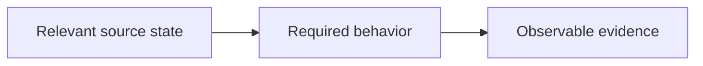

# Canonical Requirement Packet Template

Use one immutable, version-addressed file per independently falsifiable requirement revision under
`<task-root>/<planning-slug>/requirements/`, named `<stable-id>-<version>-<slug>.md`. The index at
`requirements/README.md` is the canonical ID/version register; task documents only project
filtered links to these packets. A later revision gets a new file, so an old acceptance citation
can never silently resolve to newer requirement text.

````markdown
# <stable ID> @ <version> — <short name>

| Field | Value |
| ----- | ----- |
| Stable ID | `<ID>` |
| Version | `<vN>` |
| State at packet freeze | `draft` / `approved` |
| Developer approval | `<durable ruling citation or pending>` |
| Supersedes | `<ID@prior-version or none>` |

## Normative Requirement

<One independently falsifiable obligation. Split the packet if separate clauses could be
violated, reviewed, owned, evidenced, or superseded independently.>

## Problem

<The concrete failure, ambiguity, or missing behavior this requirement resolves.>

## Required Behavior

<What must be observably true. Include relevant state transitions and recovery outcomes.>

## Rationale

<Why this behavior is required and why the chosen boundary is appropriate.>

## Scope

<Systems, actors, operations, files, or situations governed by this requirement.>

## Exclusions

<Nearby behavior explicitly outside this requirement.>

## Preservation Boundaries

<Behavior and authority that must remain unchanged while this requirement is implemented.>

## Failure And Recovery Behavior

<Important failure states, the required observable response, retry/recovery behavior, and any
state that must survive failure.>

## Examples

- Conforming: <example>
- Non-conforming: <counterexample>
- Boundary case: <example at the edge of scope>

## Forbidden Overreach

<Shortcuts or adjacent changes that appear convenient but would exceed or undermine the contract.>

## Interaction Diagram

<Add a Mermaid state, sequence, flow, or ownership diagram when it materially clarifies the
requirement. Otherwise state why prose is sufficient.>



## Expected Evidence

### Deliverable Evidence

- Required class: <code path + symbol | document section | persisted artifact | mounted UI |
  operation result | other exact class>
- Expected anchors: <what an implementer must cite>

### Verification Evidence

- Required class: <test node/symbol | command/report section | scenario | other exact class>
- Demonstrated behavior: <what the evidence must prove>
- Failure caught: <what omission or regression must make the evidence fail>

## Authority And Provenance

- Intent source: <developer ruling, policy, external specification, incident evidence, etc.>
- Durable approval: <citation | pending>
- Evidence used to compile this packet: <source refs>
- Compiler: <architect seat / task ref>

## Dependencies

- Requires: <ID@version | none>
- Constrains: <ID@version | none>
- Independently executable manifestations: <anticipated leaf slices | unknown before topology>

## Open Truth Gaps

- <Unresolved fact, owner, and what evidence would close it | none>

## Cold-Read Verification

| Field | Result |
| ----- | ------ |
| Reader | <fresh agent/seat that did not receive the planning transcript> |
| Read at | <YYYY-MM-DDTHH:MM> |
| What changes? | <reader's explanation> |
| What remains unchanged? | <reader's explanation> |
| Important failure states? | <reader's explanation> |
| What proves conformance? | <reader's explanation> |
| Verdict | `pass` / `rewrite-required` |
| Evidence ref | <turn report / review note> |

## Revision History

| Version | Date-Time | Developer ruling | Change | Acceptance invalidation |
| ------- | --------- | ---------------- | ------ | ----------------------- |
| <vN> | <YYYY-MM-DDTHH:MM> | <citation> | <initial or changed contract> | <affected IDs/leaves or N/A> |
````

## Rules

1. A packet revision is canonical and immutable after approval; sprint, master, task, and leaf
   documents link its version-addressed file and do not rewrite it.
2. A packet cannot be approved until every section is substantive, every open truth gap is named,
   and the cold-read verdict is `pass`.
3. Approval applies to one exact ID + version. A changed obligation increments the version under
   the same stable ID, creates a new version-addressed packet, records developer approval,
   invalidates affected acceptance state, and triggers rebriefing of affected leaves. Do not
   overwrite the approved prior packet.
   `requirements/README.md` is the append-only authority that marks the prior version superseded
   and points to the approved successor; the immutable prior packet keeps its frozen approved
   state and the successor packet records `Supersedes`.
4. A diagram is required only when it materially improves understanding; a decorative diagram is
   not evidence.
5. The expected-evidence section specifies evidence classes and failure sensitivity before
   implementation. It does not pre-approve an eventual artifact.
