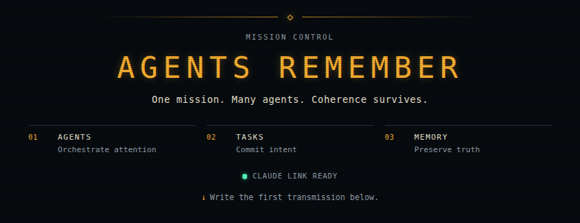

<h1 align="center">
  Agents Remember
</h1>  
<h3 align="center">
  Git-verified records for what your coding agents know. A control plane for what they do.
</h3>

<p align="center">
  
</p>

<p align="center"> 
  📖 <b>Current docs:</b> https://foxfire1st.github.io/agents-remember/</br>
  🤖 <b>Machine-readable summary:</b> https://foxfire1st.github.io/agents-remember/llms.txt</br>
  <i>Note: caches and search snippets may serve an outdated copy of this README — the docs site above is canonical and always current.</i>
</p>

<p align="center">
  
</p>

##

## Table of Contents

1. [Why It Exists](#why-it-exists)
2. [Core Features](#core-features)
3. [What It Looks Like In Practice](#what-it-looks-like-in-practice)
4. [Live Demo](#live-demo)
5. [Requirements](#requirements)
6. [Quickstart](#quickstart)
7. [Run The Dashboard](#run-the-dashboard)
8. [Documentation](#documentation)
9. [Repository Layout](#repository-layout)
10. [Status](#status)
11. [Stability](#stability)
12. [Contributing](#contributing)

## Why It Exists

Modern coding agents can make clean, plausible edits while missing the project-specific rules that make those edits safe. A top-level instruction file can help, but it does not naturally reappear when the agent is deep in a file and deciding what to change.

Agents Remember fixes that: the matching note is reachable at the moment of the edit — most often by the very path the agent is already working in — so project rules surface exactly when a change is being made, not buried in a top-level file.

## Core Features

**Agents Remember gives coding agents project memory they can verify and act on.** It turns local invariants, naming rules, migration scars, cross-repo contracts, and "this looks safe but is not" facts into versioned Markdown beside the code, checks that memory against Git before use, and updates it only after approved work lands.

```text
src/orchestrator/core_editor.py
ar-memory/onboarding/src/orchestrator/core_editor.py.md
```

- **Path-addressed memory:** A source file's note lives at a deterministic mirror path, so an agent holding a file can reach the right context without search, ranking, or guesswork.
- **Git-proven freshness:** File notes, route overviews, and entity catalogs are drift-checked against source commits, route scopes, or deterministic fingerprints before they are trusted.
- **Search that finds, not decides:** Optional semantic memory and code-graph providers help locate relevant files, callers, dependencies, and concepts, but verified Markdown and source code remain the truth.
- **Memory that lands with code:** External memory repos use a `memory.md` ledger, isolated dual worktrees, preview/apply closeout, and all-or-nothing integration so code and memory stay synchronized.
- **Repo-owned agent behavior:** Each memory repo carries `system/` files for path rules, tools, coding guidelines, documentation sources, branch policy, and reporting shape, so the same project rules load across harnesses.
- **Harness-ready first run:** Starter packages for Claude Code, Codex, Cursor, Antigravity, VS Code Copilot, Hermes, Pi.dev, and OpenClaw carry the native MCP, skills, hooks, rules, and instruction files each harness needs.

The default setup stores durable memory in the target repository under `ar-memory/`. Teams that need separate memory repositories can use external memory under `ar-coordination/memory-repos/ar-<repo>/`. For the full tour, see [Features](docs/features.md).

## What It Looks Like In Practice

A source file has an onboarding note beside it, reached by path:

```text
mcp/src/agents_remember/mcp/server.py
ar-memory/onboarding/mcp/src/agents_remember/mcp/server.py.md
```

At task start the agent orients and checks memory health:

```text
context_packet(repo_id="my-app")
memory_quality_check(repo_id="my-app")
```

It then reads the source file and its onboarding note together before proposing a change. After the change is approved and lands, the onboarding is refreshed and re-verified against the new commit — so the note stays true to the code.

## Live Demo

Agents Remember runs on itself. The companion memory repo is:
https://github.com/Foxfire1st/ar-agents-remember

That repo contains the live onboarding layer, so you can inspect how by-path memory, drift-aware updates, and contribution-time onboarding look in practice.

## Requirements

Before the Quickstart, make sure the host has:

- **[uv](https://docs.astral.sh/uv/)** (for `uvx`) or pip, and **Python 3.11+** — the agent runs the MCP server with `uvx`, which picks a compatible interpreter.
- **Git**, with `user.name` / `user.email` configured (memory and worktree commits need an author; otherwise a placeholder identity is used).
- **Docker** running, only if you enable the optional providers. The semantic-memory provider (grepai) also uses a Dockerized Ollama and pulls an embedding model (`nomic-embed-text`) on first setup — no host Ollama install needed.

Providers, Docker, and Ollama are only needed for the optional Docker-backed
providers; the core by-path memory works without them. Claude Code hooks do not
require `jq`; the current starter package uses a Python hook. Full detail and
troubleshooting live in the [MCP package README](https://pypi.org/project/agents-remember-mcp/).

## Quickstart

This is the short path for a new workspace. The detailed walkthrough lives in [Getting Started](docs/getting-started.md).

Ask your agent to:

1. **Copy the harness package** — Pick your harness guide under
   [docs/install](docs/install/README.md), copy that harness's native starter
   files from this repo into the workspace, then render the copied package.
   The `render-starter` script is a convenience: it infers the workspace root
   from the copied harness folder and fills the copied package's path,
   repository, and hook-command placeholders from a single `--repo` list such as
   `--repo my-app shared-lib`. You can also do those replacements by hand. These
   packages include the harness-visible skills, hooks/rules/instructions, and
   MCP settings templates.
2. **Wire the MCP server** — Register Agents Remember MCP from
   [PyPI](https://pypi.org/project/agents-remember-mcp/) with `uvx`:

   ```text
   uvx agents-remember-mcp@latest --config /absolute/path/to/agents-remember-settings.json
   ```

   Use the `agents-remember-settings.json` path from the copied harness package.
   Then **restart the harness once** so it loads the MCP server, native skills,
   and package hooks/rules/instructions.
3. **Onboard your project** — Invoke the copied skill
   `c-13-install-and-onboard`. It runs or verifies `runtime_install()`, asks
   whether to scaffold a new memory repo or use an existing one, bootstraps
   onboarding when needed, and starts provider indexing when providers are
   enabled.

That is the normal first-run path. `skills_install()` remains available as a
maintenance/manual MCP tool, but the starter packages already provide the
initial skills and harness files.

After that, normal work runs through the `l-01-agent-lifecycles` skill: a developer-facing session is the architect; spawned backend orchestrators and other role seats follow their role briefs. The agent resolves the active context with `c-08-ar-coordination-context-resolver`, checks memory quality with `c-02-memory-quality-control`, reads relevant onboarding beside code, and updates onboarding after approved changes.

## Run The Dashboard

The mission-control dashboard ships inside the MCP package. Install the CLI
once with uv — latest stable, no version pin — then start the cockpit from
anywhere in your workspace:

```text
uv tool install agents-remember-mcp
agents-remember dashboard
```

`--config` is optional: the CLI walks up from the current directory and uses
the nearest `.claude/mcp/agents-remember-settings.json`, or the `--config`
recorded in an `.mcp.json` `agents-remember` entry — the same settings file
the MCP server boots from.

For a dashboard that survives closing the terminal, use daemon mode:

```text
agents-remember dashboard --daemon    # detach; state + log under <coordinationRoot>/logs/dashboard/
agents-remember dashboard --status    # exit 0 when running, 1 when not
agents-remember dashboard --stop
```

Or let the MCP server supervise it: set `"dashboard": {"autoStart": true}` in
the MCP settings JSON and every server boot ensures the daemon — adopting a
healthy one, starting a missing one, and restarting on version mismatch so an
upgrade is picked up by the next session
([Settings Reference](docs/reference/settings-json.md)).

Pinning a version is the debugging/repro path, not the default: `uv tool
install 'agents-remember-mcp==3.0.0rc6'`, or one-shot without installing,
`uvx --from 'agents-remember-mcp==3.0.0rc6' agents-remember dashboard`.

> **Pre-release note (until 3.0.0 final):** the dashboard currently ships in
> `3.0.0rcN` pre-releases, which default version resolution skips. Install with
> `uv tool install --prerelease allow agents-remember-mcp`, and register the
> MCP server with an explicit `agents-remember-mcp==3.0.0rcN` pin instead of
> `@latest`.

## Documentation

- [Features](docs/features.md) - the concentrated tour of what Agents Remember gives users.
- [Getting Started](docs/getting-started.md) - a fuller first-run setup.
- [Concepts](docs/concepts.md) - onboarding units, memory roots, drift, and approval gates.
- [Architecture](docs/architecture.md) - runtime, coordination, internal memory, and external memory.
- [Workflows](docs/workflows.md) - the `l-01-agent-lifecycles` skill and its build modes (research-only exit / `w-02-light-task-workflow` skill task / master + light sub-task series), and when to use each.
- [Benchmark Methodology](docs/benchmarks-methodology.md) - how paired `codex exec --json` runs are captured and compared.
- [FAQ](docs/FAQ.md) - design principles, objections, and comparisons.
- [External Memory Guide](docs/guides/use-external-memory.md) - separate memory repos for selected code repos.
- [Cost-aware Bootstrap](docs/guides/cost-aware-bootstrap.md) - model and wave-sizing choices for token-heavy repository bootstrap.
- [Settings Reference](docs/reference/settings-json.md) - memory-layer `system/settings.json` and MCP authority settings.
- [Skills Reference](docs/reference/skills.md) - the installed skill families.

## Repository Layout

```text
agents-remember/
  AGENTS.md                         # source checkout instructions
  README.md                         # public front door
  skills/                           # canonical skill source tree
  scripts/sync-skills.py            # sync skills into package/harness copies
  scripts/sync-runtime.py           # sync runtime assets into package data
  agents-md-files/                  # canonical installed AGENTS.md templates
  benchmarks/                       # canonical optional benchmark package source
  providers/                        # canonical provider runtime assets
  system/defaults/examples/         # canonical scaffold examples
  mcp/                              # package-local MCP server and services
    src/agents_remember/package_data/
      runtime/
        agents-md-files/            # generated copy of root agents-md-files/
        skills/                     # generated package copy of root skills/
        providers/                  # generated copy of root providers/
        system/defaults/examples/   # generated copy of root system/defaults/examples/
      benchmarks/                   # generated copy of root benchmarks/
  docs/                             # user-facing documentation
```

Edit skills in root `skills/`, then run `python3 scripts/sync-skills.py` to
refresh the MCP package data and every harness starter package. The pre-commit
and pre-push hooks run `python3 scripts/sync-skills.py --check`.

Edit runtime assets in root `agents-md-files/`, `benchmarks/`, `providers/`,
and `system/`, then run `python3 scripts/sync-runtime.py` to refresh MCP package
data only. The pre-commit and pre-push hooks run
`python3 scripts/sync-runtime.py --check`.

The hooks are tiered, and both are thin wrappers over `.githooks/_gate.sh`.
pre-commit runs the fast tier over the **staged** content: the generated-copy
checks above, plus Ruff and Pyright. pre-push runs the full tier:
`python -m agents_remember.code_quality.check`, whose default command enforces
Ruff, Pyright, the full pytest suite, and the configured CRAP threshold. CI runs
that same wrapper on every branch push and pull request, and closeout runs it
before creating an Agents Remember code commit even when hooks are not
configured. See CONTRIBUTING.md for the tier table and the staged-content
stash contract.

The installed runtime lives in `ar-coordination/` — by default `<workspace>/ar-coordination/`,
inside the workspace (never your home directory) — not in the source checkout. The
`c-13-install-and-onboard` skill shows this and every other install path as a workspace-first
default you can accept or override:

```text
ar-coordination/
  AGENTS.md
  skills/
  system/
  memory-repos/
  providers/                        # provider runtimes (images, runners, indexes)
  benchmarks/                       # optional, installed with --include-benchmarks
  tasks/
  notes/
  worktrees/
  temp/
```

## Status

Agents Remember is at `3.0.0rc6` and actively developed. The core path — by-path onboarding, drift checks, and approval-gated updates — is in real use and stable enough to rely on. The public contracts listed under [Stability](#stability) are held stable across minor releases and change only on a major bump; the internals beneath them and the optional semantic/relationship providers may still evolve, so pin a version and read the notes for your target version in [GitHub Releases](https://github.com/Foxfire1st/agents-remember/releases) — the repository's canonical changelog — before upgrading. The Claude Code path is the most exercised; other harnesses are supported but less battle-tested.

The 3.0 arc: the working session itself is now observable and steerable — a system-managed agent lifecycle with durable approval gates and an event/projection layer, served as the mission-control browser cockpit directly from the MCP package (`agents-remember dashboard`; [#2](https://github.com/Foxfire1st/agents-remember/issues/2), [#43](https://github.com/Foxfire1st/agents-remember/issues/43)). The `rc` tag means the cockpit surface is still settling toward the final 3.0.0 contract; the architecture beneath it is the one described above.

## Stability

Following semantic versioning from `1.0.0`, these public contracts will not change without a **major** version bump: **skill IDs** (e.g. the `c-08-ar-coordination-context-resolver` and `w-02-light-task-workflow` skills), **MCP tool names and their inputs/outputs**, the **`ar-coordination/` and `ar-memory/` layout**, and the **settings schema**. Internal modules, provider internals, and prompt wording are not part of this promise and may change in minor releases.

## Contributing

Contributions should make the memory layer clearer, safer, and easier to apply consistently. Start with [CONTRIBUTING.md](CONTRIBUTING.md) and keep the core rules intact: drift check before planning, approval before implementation, and onboarding updates only after approved changes.

Agents Remember runs on itself, so the best way to contribute is with the memory layer active. Download or clone this project's own memory at [Foxfire1st/ar-agents-remember](https://github.com/Foxfire1st/ar-agents-remember) and use it as the Agents Remember memory for your checkout: you get the project's by-path onboarding at the moment you edit, and your onboarding updates land alongside your code changes — the same loop this repo asks of every contribution.
