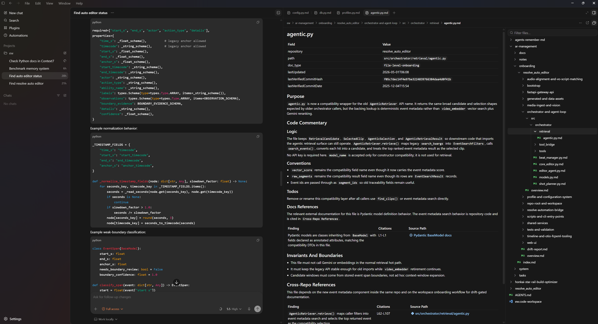
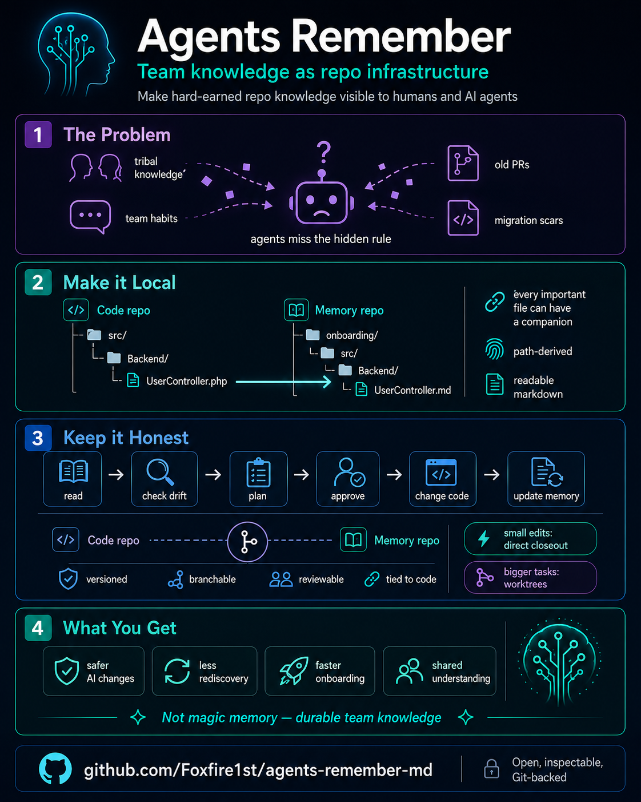

# Agents Remember

_"My agent keeps forgetting everything. So I made it write notes to its future self."_

Modern coding agents look superhuman one moment, then hit you with a divine stroke of idiocy the next.

On a small task, an `AGENTS.md` file, a few prompt rules, and a strong model can feel almost magical. That creates the illusion that the agent already “knows the codebase.” **In larger systems, that illusion breaks.** The agent does not actually know your architecture, your hidden invariants, your migration scars, or the strange rules everyone on the team has learned the hard way. It only knows what the repository makes legible.

That is why the failures are so weird. The output looks plausible. The edit is clean. **The regression is real.**

A single top-level instruction file can point the agent in the right direction, but it cannot reappear exactly when the agent needs it. **Once the agent is deep in a file, the relevant context is no longer naturally in front of it.** Recovering it becomes an explicit search problem: expensive, uncertain, and easy to skip.

It is like handing someone a city map at the train station and taking it away before they start walking. The problem is not that they never saw the map. The problem is that it is gone when they need it on the next turn.

That's where Agents Remember's simple premise starts: important project knowledge should not have to be hunted down. If it is not local, structured, and discoverable, **then for the agent it effectively does not exist.**

So the way forward is to make that missing context visible before the agent has to guess.

## What This Looks Like

An agent touches:

```text
resolve_auto_editor/src/orchestrator/core_editor.py
```

In the default local mode, it checks the repo-local onboarding unit:

```text
resolve_auto_editor/ar-memory/onboarding/src/orchestrator/core_editor.py.md
```

Before trusting that file, it runs drift detection:

```text
core_editor.py.md       drifted      source changed since 4d1fdf2
shot_planner.py.md      drifted      source changed since 4d1fdf2
22 other files          up to date
```

Then it refreshes only the stale onboarding and plans against current context, not old notes.

The same pattern can also live in an external memory repo.

This repo's working memory layer can be inspected here as an example:

[https://github.com/Foxfire1st/ar-agents-remember-md](https://github.com/Foxfire1st/ar-agents-remember-md)

That memory repo has the shape Agents Remember expects:

```text
ar-coordination/memory-repos/ar-agents-remember-md/
  README.md
  memory.md
  onboarding/
    overview.md
    README.md.md
    skills/...
```

`memory.md` is the ledger. It records which memory commit was verified against which code commit:

```text
<code commit> | <memory commit>
```

That means the knowledge layer can move through Git the same way code does. A release branch, migration branch, or long-running feature branch can carry the version of memory that matches that branch's code.

The memory repo for this project is intentionally readable as a working example of the memory layer itself.



---

## Why I made this repo

Imagine you work in a multi-repo product workspace. Configurator, firmware, user & device management, cloud services, etc. All of it revolving around one product. And some of the code has been growing for decades.

That is exactly the kind of environment where agents struggle. A small issue is fine. But for migrations or cross-repo changes, the important knowledge is rarely in one file. It is spread across repos, conventions, old decisions, and domain-specific quirks. Asking an agent to rediscover all of that from scratch every time either blows up the context window or produces shallow answers.

The idea came from our embedded code. Many files had large comment sections at the top: who changed what, when, and what strange behavior mattered. At first that looked excessive. But as I browsed, I realized those comments let me understand code I had never worked in before. I could read some, sure, but the commentary gave me the shape of the system much faster than code alone would have.

I wanted that same effect for developers working with agents. But I did not want to force extra commentary into source files for teams that prefer to keep code surfaces clean, and I did not want the knowledge layer to drift without explicit verification. So the first version of this repo kept the extended commentary separate and deterministic: one mirrored markdown onboarding unit per source file.

The local sidecar file is the default, but it is not the whole idea. The real trick is not markdown for its own sake. The trick is 1-to-1 onboarding. If an agent is working on `src/foo/bar.ts`, it should know exactly where the onboarding unit lives and how to verify it. In the default internal setup that means `ar-memory/onboarding/src/foo/bar.ts.md` inside the target repo. In inline storage that means the structured onboarding block inside `src/foo/bar.ts` itself. No secret wiki, no guessing, no giant context dump. The agent can onboard itself from the file it is touching and discover the hidden contracts around it naturally.

That is what this repository is trying to make practical: a collaborative knowledge layer that grows as work happens. Documentation stops being a second job and becomes a trail of useful context left behind by real tasks.

The onboarding units are a shared knowledge substrate. Versioned in git, readable by people, and easy for agents to retrieve. That transfer of knowledge between developers, tools, and future sessions is the heart of this project.

---

## Techstack

```text
Skills for Claude Code, Cursor, VS Code, and similar tools. No software dependencies.
Just markdown files and conventions.
```

---

## Quickstart

Clone this repository wherever it makes sense for your setup. The examples below place `agents-remember-md` beside the code repository because that is easy to inspect, but the checkout does not have to live inside the same workspace as the code. The default setup keeps durable memory artifacts inside the repository you are onboarding, under that repository's own `ar-memory/` folder. Local coordination state such as tasks, notes, and worktrees belongs in `ar-coordination/`:

```text
projects/
  AGENTS.md                   ← workspace AGENTS.md
  agents-remember-md/         ← this repo
    AGENTS.md
  my-app/                     ← your existing repo
    src/
    ar-memory/                ← durable memory for this repo
      onboarding/
      docs/
      system/
        settings.md
        settings.json
        sources.md
        tools.md
  ar-coordination/              ← local coordination
    system/
    memory-repos/
    tasks/
    notes/
    worktrees/
```

---

### Install Skills Into Your Harness

Some harnesses can read skills directly from a repository you add to the workspace. Others only discover skills from specific skills folders such as `.agents/skills`, `.cursor/skills`, `.claude/skills`, `.windsurf/skills`, or their user-wide equivalents. For those harnesses, do not copy the Agents Remember skill files. Use the installer to create symlinks from the harness skills folder back to the canonical checkout.

The default layout creates one namespace symlink to the full canonical skill tree:

```bash
./agents-remember-md/scripts/install-skills.sh \
  --install-root ./.agents/skills
```

The command creates:

```text
<install-root>/agents-remember-md -> <agents-remember-md-checkout>/skills
```

The namespace folder is intentional for harnesses with recursive skill discovery, including Codex and Claude Code. They can discover the nested `SKILL.md` files through this symlink while the scripts still resolve back to the real checkout.

For harnesses that expect direct `<skill-name>/SKILL.md` folders, use the flat symlink layout:

```bash
/path/to/agents-remember-md/scripts/install-skills.sh \
  --install-root ./.windsurf/skills \
  --layout flat
```

That creates lowercase, frontmatter-named symlinks such as:

```text
<install-root>/c-08-ar-coordination-context-resolver -> <agents-remember-md-checkout>/skills/U-01-core-skills/C-08-ar-coordination-context-resolver
```

For a checkout outside the workspace, keep the checkout where it is and point the install command at the workspace or harness skills folder:

```bash
/opt/agents-remember-md/scripts/install-skills.sh \
  --install-root /work/my-app/.agents/skills
```

The symlink matters because several core helper scripts resolve sibling skills and shared modules from the canonical skill tree. Copying individual skill folders can break those relative paths and can also make local `.env` configuration invisible to the resolver.

---

### Create The Local Memory And Coordination Folders

Initialize the target repository with `C-00-initialize-coordination-root`. This first-run skill defaults to internal topology, creates the target repo's local `ar-memory/` durable-memory folder, and ensures a local `ar-coordination/` coordination root exists for tasks, notes, worktrees, and external memory repos. It writes starter `settings.md`, `settings.json`, `sources.md`, and `tools.md` files under the memory layer without overwriting existing files.

The resulting internal memory scaffold looks like this:

```text
ar-memory/
├── onboarding/
├── docs/
└── system/
    ├── settings.md
    ├── settings.json
    ├── sources.md
    └── tools.md
```

The local coordinator scaffold is separate:

```text
ar-coordination/
├── system/
├── memory-repos/
├── tasks/
├── notes/
└── worktrees/
```

`C-00` intentionally leaves `onboarding/` empty; `C-03-repo-bootstrap` owns repo onboarding below that point. The starter memory-layer `system/settings.md` is the human and agent instruction file, while `system/settings.json` is the machine-readable settings file for storage, `pathRules`, and cross-repo allowances. The starter `system/sources.md` and `system/tools.md` are intentionally plain; fill them in with project-specific docs, commands, and checks as repos are onboarded.

---

### Storage And Path Eligibility

Agents Remember treats file-level onboarding as an onboarding unit. The unit can be stored as a repo-local sidecar markdown file, or as an inline block inside the source file when a repo explicitly selects inline storage.

Storage choice and path eligibility are different concerns in `system/settings.json`:

- `onboarding.storage` decides where eligible onboarding artifacts live.
- `onboarding.pathRules` decides which source paths and file types are eligible for onboarding.

Default internal storage is `repo-sidecar`, which stores onboarding directly under the target repository's `ar-memory/onboarding/` folder using source-relative paths.

Repo-level architecture context stays in `ar-memory/onboarding/overview.md` for internal-memory mode, or in the selected external memory repo's `onboarding/overview.md` for external-memory mode. If a repo needs deeper coverage beyond the first overview pass, extend that same overview by merging the new area findings into the relevant existing sections so it remains one coherent document instead of growing a permanent `onboarding/<component>/overview.md` layer.

`pathRules` exist in both internal-memory and external-memory JSON settings. They include or exclude paths and file types; they do not switch storage per path. In repo-local internal settings, an unscoped rule applies to that repository. In external-memory settings, scope rules with `path: <repo-name>` so each memory repo can have its own eligibility rules. Leave a rule unscoped only when you intentionally want the same eligibility default for every external memory repo.

```json
{
  "version": 1,
  "onboarding": {
    "storage": {
      "mode": "repo-sidecar"
    },
    "pathRules": {
      "include": {
        "paths": ["README.md", "docs/**", "src/**"],
        "fileTypes": [".md", ".py", ".ts", ".tsx"]
      },
      "exclude": {
        "paths": ["vendor/**", "node_modules/**", "dist/**"],
        "fileTypes": [".png", ".zip"]
      }
    }
  }
}
```

Inline onboarding reuses the same file-level onboarding content model as sidecar onboarding. Only storage, comment syntax, placement, parsing, digesting, and fallback behavior differ.

---

### Wire Up Your Agent

The steps are the same regardless of which tool you use:

1. Wire up the agent so it reads `AGENTS.md` from this repo at session start (tool-specific instructions below).
2. If the harness requires skills to live in a dedicated skills folder, run `scripts/install-skills.sh --install-root <that-folder>` from the Agents Remember checkout. Use the default tree layout for recursive scanners, and add `--layout flat` for harnesses that require direct `<skill-name>/SKILL.md` folders.
3. Run `C-00-initialize-coordination-root` for the target repo if its local `ar-memory` scaffold or local coordination root does not exist yet.
4. Run `C-03-repo-bootstrap` to scaffold the initial onboarding structure under the C-08 resolved `onboarding_root`, usually `<target-repo>/ar-memory/onboarding/` in internal mode. A bare repo-level `overview.md` is enough; deeper area sections are folded back into that same file as the repo is explored.
5. Start using the agent normally. Chat handles most tasks. The agent reads the resolved onboarding unit alongside the source file and updates it as it goes.
6. Escalate to `W-02-light-task-workflow` or `W-01-heavy-task-workflow` when the task needs a written plan or needs to survive beyond a single session.

Coverage builds from real work. The first task on a file usually creates or refreshes its onboarding unit; every task after benefits from that local context.

---

### Codex

Codex reads `AGENTS.md` for workspace instructions, but its `/` skill picker discovers skills from Codex skill locations such as `.agents/skills` or `~/.agents/skills`. Add an `AGENTS.md` at the root of your projects folder:

```markdown
# Workspace Agent Instructions

Read and follow `agents-remember-md/AGENTS.md` before working in any sibling project.
Treat these rules as workspace instructions!

@agents-remember-md/AGENTS.md
```

Then install the skills into the Codex-visible folder for that workspace:

```bash
./agents-remember-md/scripts/install-skills.sh \
  --install-root ./.agents/skills
```

If the `agents-remember-md` checkout lives outside the workspace, run the installer from that checkout and point `--install-root` at the workspace Codex skills folder:

```bash
/opt/agents-remember-md/scripts/install-skills.sh \
  --install-root /work/my-app/.agents/skills
```

For user-wide Codex skills, target the home skills folder:

```bash
/opt/agents-remember-md/scripts/install-skills.sh \
  --install-root ~/.agents/skills
```

In all cases, make sure the `AGENTS.md` instruction points to the actual checkout path the harness can read.

---

### Claude Code

Claude Code has two separate setup pieces: `CLAUDE.md` for always-loaded workspace instructions, and `.claude/skills` or `~/.claude/skills` for native skill discovery.

Add a `CLAUDE.md` at the root of your projects folder:

```markdown
# Workspace Agent Instructions

Read and follow `agents-remember-md/AGENTS.md` before working in any sibling project.
Treat these rules as workspace instructions!

@agents-remember-md/AGENTS.md
```

Claude Code imports the file into context at session start. This does not install native skills by itself, so also install the canonical skill tree into a Claude-visible skills folder.

For project-local Claude Code skills:

```bash
./agents-remember-md/scripts/install-skills.sh \
  --install-root ./.claude/skills
```

For user-wide Claude Code skills:

```bash
/path/to/agents-remember-md/scripts/install-skills.sh \
  --install-root ~/.claude/skills
```

If the `agents-remember-md` checkout lives outside the workspace, run the installer from that checkout and target the project's `.claude/skills` folder:

```bash
/opt/agents-remember-md/scripts/install-skills.sh \
  --install-root /work/my-app/.claude/skills
```

Claude Code discovers skills from personal `~/.claude/skills`, project `.claude/skills`, plugin skills, and `.claude/skills` folders inside directories added with `--add-dir`. Current Claude Code also supports nested skill discovery, so the installer-created namespace symlink is enough; do not create or maintain per-skill symlinks. If the checkout is outside the workspace, point `CLAUDE.md` at the actual path Claude Code can read.

---

### Hermes.md

Hermes Agent discovers project context files such as `.hermes.md`, `HERMES.md`, `AGENTS.md`, and `CLAUDE.md`. Use `AGENTS.md` when you want the same workspace instruction pattern as Codex and Pi, or `HERMES.md` when you want Hermes-specific priority.

For a shared projects folder, add `AGENTS.md` or `HERMES.md` at the root:

```markdown
# Workspace Agent Instructions

Read and follow `agents-remember-md/AGENTS.md` before working in any sibling project.
Treat these rules as workspace instructions!

@agents-remember-md/AGENTS.md
```

Hermes stores local skills under `~/.hermes/skills/`, with category folders allowed. Install a flat Agents Remember category so each visible skill folder matches its lowercase `name`:

```bash
/path/to/agents-remember-md/scripts/install-skills.sh \
  --install-root ~/.hermes/skills/agents-remember-md \
  --layout flat
```

If you prefer a shared skills folder, install there and add it to `~/.hermes/config.yaml`:

```bash
/path/to/agents-remember-md/scripts/install-skills.sh \
  --install-root ~/.agents/skills/agents-remember-md \
  --layout flat
```

```yaml
skills:
  external_dirs:
    - ~/.agents/skills
```

---

### Pi.dev

Pi loads `AGENTS.md` or `CLAUDE.md` from the current directory, parent directories, and `~/.pi/agent/AGENTS.md`. Add the same workspace `AGENTS.md` used by Codex:

```markdown
# Workspace Agent Instructions

Read and follow `agents-remember-md/AGENTS.md` before working in any sibling project.
Treat these rules as workspace instructions!

@agents-remember-md/AGENTS.md
```

Pi loads skills from project `.pi/skills`, project `.agents/skills`, global `~/.pi/agent/skills`, global `~/.agents/skills`, settings paths, and repeated `--skill <path>` flags. Use the flat layout so each symlink folder matches the lowercase skill name:

```bash
./agents-remember-md/scripts/install-skills.sh \
  --install-root ./.pi/skills \
  --layout flat
```

For a cross-agent project install:

```bash
./agents-remember-md/scripts/install-skills.sh \
  --install-root ./.agents/skills \
  --layout flat
```

For global Pi skills:

```bash
/path/to/agents-remember-md/scripts/install-skills.sh \
  --install-root ~/.pi/agent/skills \
  --layout flat
```

---

### OpenClaw

OpenClaw uses a dedicated agent workspace. Put the Agents Remember instruction in that workspace's `AGENTS.md`, pointing at the actual checkout path OpenClaw can read:

```markdown
# Workspace Agent Instructions

Read and follow `/path/to/agents-remember-md/AGENTS.md` before working in any target project.
Treat these rules as workspace instructions!

@/path/to/agents-remember-md/AGENTS.md
```

OpenClaw loads workspace skills from `<workspace>/skills` and shared local skills from `~/.openclaw/skills`. Workspace skills have higher precedence, so install there when the guidance is project-specific:

```bash
/path/to/agents-remember-md/scripts/install-skills.sh \
  --install-root /path/to/openclaw-workspace/skills \
  --layout flat
```

For shared skills visible to all OpenClaw agents on the machine:

```bash
/path/to/agents-remember-md/scripts/install-skills.sh \
  --install-root ~/.openclaw/skills \
  --layout flat
```

OpenClaw can also load extra skills folders through `skills.load.extraDirs` in `~/.openclaw/openclaw.json`, but direct workspace or shared installs are the clearest setup for Agents Remember.

---

### Cursor

Cursor has both persistent instructions and native Agent Skills. For instructions, use either a root-level `AGENTS.md` or a project rule. In a workspace with multiple sibling repositories, a project rule is usually more explicit.

Create `.cursor/rules/agents-remember.mdc` in your projects folder:

```markdown
---
description: Agents Remember memory system conventions
alwaysApply: true
---

Read and follow `agents-remember-md/AGENTS.md` before working in any sibling project.
Treat these rules as workspace instructions!

@agents-remember-md/AGENTS.md
```

Then install the skills into a Cursor-visible skills folder. Cursor discovers skills from `.agents/skills`, `.cursor/skills`, `~/.agents/skills`, and `~/.cursor/skills`, and it also scans Claude/Codex compatibility folders. It walks skill roots recursively and exposes skills through the `/` menu, but its current skill format expects the frontmatter `name` to match the containing folder. Agents Remember keeps uppercase canonical folder IDs, so use the flat symlink layout for Cursor:

```bash
./agents-remember-md/scripts/install-skills.sh \
  --install-root ./.cursor/skills \
  --layout flat
```

For a shared project-level install that other harnesses can also read:

```bash
./agents-remember-md/scripts/install-skills.sh \
  --install-root ./.agents/skills \
  --layout flat
```

For user-wide Cursor skills:

```bash
/path/to/agents-remember-md/scripts/install-skills.sh \
  --install-root ~/.cursor/skills \
  --layout flat
```

If the checkout is outside the workspace, run the installer from that checkout and target the workspace or user skills folder. Make sure the Cursor rule or `AGENTS.md` points at the actual checkout path Cursor can read.

---

### VS Code + GitHub Copilot

Open (or create) a `.code-workspace` file that includes both repositories as folders. Copilot needs the skills directories listed explicitly in `chat.agentSkillsLocations` — without this setting it won't discover them:

```json
{
  "folders": [{ "path": "agents-remember-md" }, { "path": "my-app" }],
  "settings": {
    "chat.agentSkillsLocations": {
      "agents-remember-md/skills": true,
      "agents-remember-md/skills/U-01-core-skills": true,
      "agents-remember-md/skills/W-01-heavy-task-workflow": true,
      "agents-remember-md/skills/W-01-heavy-task-workflow/skills": true,
      "agents-remember-md/skills/W-01-heavy-task-workflow/skills/P-00-creation": true,
      "agents-remember-md/skills/W-01-heavy-task-workflow/skills/P-01-research": true,
      "agents-remember-md/skills/W-01-heavy-task-workflow/skills/P-02-synthesis": true,
      "agents-remember-md/skills/W-01-heavy-task-workflow/skills/P-03-design": true,
      "agents-remember-md/skills/W-01-heavy-task-workflow/skills/P-04-planning": true,
      "agents-remember-md/skills/W-01-heavy-task-workflow/skills/P-05-implementation": true,
      "agents-remember-md/skills/W-01-heavy-task-workflow/skills/P-99-review": true,
      "agents-remember-md/skills/W-02-light-task-workflow": true,
      "agents-remember-md/skills/W-03-chat-task-workflow": true
    }
  }
}
```

You can add a `.github/copilot-instructions.md` in the code repo to layer on any repo-specific overrides.

If your Copilot or VS Code setup cannot point directly at the checkout, install the symlink into a workspace-local skills folder and point `chat.agentSkillsLocations` at the symlinked tree:

```bash
/path/to/agents-remember-md/scripts/install-skills.sh \
  --install-root /path/to/workspace/.agents/skills
```

---

### Windsurf

Windsurf Cascade automatically discovers `AGENTS.md` files in the workspace. A root-level `AGENTS.md` is always on, and nested `AGENTS.md` files are scoped to their directories. Add both repositories to the workspace when possible, or point the root instruction at the actual readable checkout path.

Windsurf also has native Skills. Workspace skills live in `.windsurf/skills/<skill-name>/SKILL.md`; global skills live in `~/.codeium/windsurf/skills/<skill-name>/SKILL.md`. Cascade can invoke skills automatically or manually with `@skill-name`. It also scans `.agents/skills` and `~/.agents/skills` for cross-agent compatibility, and scans `.claude/skills` / `~/.claude/skills` when Claude Code config reading is enabled.

Use the flat symlink layout so Windsurf sees direct skill folders with lowercase names:

```bash
./agents-remember-md/scripts/install-skills.sh \
  --install-root ./.windsurf/skills \
  --layout flat
```

For a shared project-level install:

```bash
./agents-remember-md/scripts/install-skills.sh \
  --install-root ./.agents/skills \
  --layout flat
```

---

## The three modes

Most tasks don't need a framework. They need an agent that already knows the codebase. That's what the memory layer provides, and that's why the default mode is just **chat**.

| Mode               | When                                                                                                      | What the agent does                                                                                                                                                                             |
| ------------------ | --------------------------------------------------------------------------------------------------------- | ----------------------------------------------------------------------------------------------------------------------------------------------------------------------------------------------- |
| **Chat** (default) | Simple tasks that fit in one session                                                                      | Reads onboarding alongside code, proposes changes with code examples in chat, implements on approval, updates onboarding                                                                        |
| **Light task**     | Medium tasks, or tasks likely to outlive one session                                                      | Writes a single-page plan to a task file, gets approval, implements, updates onboarding                                                                                                         |
| **Heavy task**     | Migrations, cross-repo contracts, changes where "looks right, breaks in production" would be catastrophic | Seven phases with review gates and adversarial checkpoints, projected code+intent before touching real code, task-local docs that promote into onboarding only after implementation is approved |

Small chat-mode edits can still use the current checkout. In external-memory mode, `C-09-git-worktree-manager direct-closeout` handles the approved commit sequence for those micro edits: commit code first, refresh affected onboarding metadata to that code commit, commit memory, then update the ledger. Larger or parallel work should still use C-09 worktrees so integration and cleanup stay explicit.

All three modes share the same three-part discipline:

1. **Resolve, then drift check before planning.** Before the agent plans against onboarding, it uses `C-08-ar-coordination-context-resolver` to resolve the active coordination context, then verifies that the resolved onboarding unit is not stale against the source. The `C-02-onboarding-drift-detection` skill runs this check and classifies trust.
2. **Approval before implementation.** The agent proposes changes. The developer approves. No implicit approval, no "I'll just make this small edit."
3. **Onboarding update after approved changes.** Onboarding reflects approved code, not speculation. The update happens after the developer approves the change, not before.

The drift check establishes a start-of-task baseline for pre-existing files. It does not mean the agent must refuse to read files it just created or dirtied during the current task; those are task-local working state and stay pending verification until the next verification pass.

---

## What makes the memory layer honest

Memory systems fail in two ways. They go stale (the code moves, the docs don't). They get polluted with speculation (an agent writes what it _planned_ to build, not what exists). This system addresses both:

**Staleness.** Each onboarding unit records verification metadata appropriate to its storage mode. Sidecar onboarding records the source file's verified git commit. Inline onboarding records a source digest computed from the file body with the onboarding block removed. Before any planning work, the agent uses `C-08-ar-coordination-context-resolver` to resolve where onboarding lives, then `C-02-onboarding-drift-detection` checks that metadata against the current source and routes stale onboarding for refresh before planning continues.

**Pollution.** The approval gate is global: no unapproved work goes into onboarding. In chat mode, the gate is the developer's approval turn. In light task, it's approval of the plan and of the implementation. In heavy task, it's the promotion step at Closure after CP5 passes. Task-local artifacts — input documentation, projected outputs, implementation plans — stay task-local until implementation is approved. Only then does anything reach the canonical onboarding tree.

Both guarantees hold across all three modes. The memory layer only accepts validated history, the same discipline git applies to `main`.

---

## Repository bootstrapping

Onboarding does not need to be fully present before you can use the system. A repo with no onboarding can start with a bare `overview.md` and be scaffolded by using the `C-03-repo-bootstrap` skill. From there it can grow organically as tasks touch new areas. The first task on a file pays the cost of creating or refreshing that file's onboarding unit; every task after that benefits.

For bulk coverage the `C-03-repo-bootstrap` skill can do more. After `overview.md` you can scaffold an entire repo in phases. Start with the hotspots and then go into detail where needed. You can bootstrap hundreds of files in a session, which is nowadays practical on current models using sub-Agents and parallelism.

---

## Advanced: External Memory And Coordination

Most users should start with repo-local internal memory. External-memory mode is for teams that intentionally want a separate memory repo for one or more selected repositories.

In external-memory mode, create or choose an `ar-coordination/` root. C-08 defaults to `../ar-coordination` relative to the `agents-remember-md` checkout. That default is only a convenience; the coordinator can live anywhere. To use a different coordinator, configure `AR_COORDINATION_ROOT` in `agents-remember-md/.env`:

```dotenv
AR_COORDINATION_ROOT=../ar-coordination
```

Absolute paths are valid too:

```dotenv
AR_COORDINATION_ROOT=/srv/agents/ar-coordination
```

This setting is independent from skill installation. `scripts/install-skills.sh` only creates a symlink so a harness can discover the skills. C-08 follows that symlink back to the real checkout and reads the `.env` beside the checkout, so this layout is supported:

```text
/opt/agents-remember-md/
  .env                    # AR_COORDINATION_ROOT=/srv/agents/ar-coordination
  skills/
  scripts/install-skills.sh

/srv/agents/ar-coordination/

/work/my-app/
  .agents/skills/
    agents-remember-md -> /opt/agents-remember-md/skills
```

External-memory mode keeps local coordination under `ar-coordination/`, but durable memory lives in one memory repo per code repo under `ar-coordination/memory-repos/ar-<repo-name>/`. Each memory repo has its own `system/settings.md` for prose guidance and `system/settings.json` for machine-readable settings:

```json
{
  "version": 2,
  "onboarding": {
    "storage": {
      "mode": "memory-repo"
    },
    "pathRules": {
      "include": {
        "paths": ["README.md", "docs/**", "src/**"],
        "fileTypes": [".md", ".py", ".ts", ".tsx"]
      },
      "exclude": {
        "paths": ["vendor/**", "node_modules/**", "dist/**"],
        "fileTypes": [".png", ".zip"]
      }
    }
  },
  "crossRepo": {
    "allow": []
  }
}
```

---

### External Memory For Selected Repositories

Use this when a selected repository should store durable memory in its own external memory repo:

```text
projects/
  agents-remember-md/
  ar-coordination/              ← local coordinator
    system/
      settings.md
      settings.json
    memory-repos/
      ar-my-app/              ← durable memory repo for my-app
        onboarding/
        docs/
        system/
        memory.md
    tasks/
    notes/
    worktrees/
  my-app/
```

Run `C-00-initialize-coordination-root` in external mode only when the developer explicitly asks for external-memory scaffolding. Default C-00 behavior remains repo-local internal memory plus local coordination.

---

### External Beside Local Repositories

Mixed workspaces are supported. C-08 resolves topology per target repository:

```text
projects/
  agents-remember-md/
  repo-a/
    ar-memory/                ← repo-a uses local internal memory
      system/settings.md
      system/settings.json
      onboarding/
  ar-coordination/              ← local coordinator
    system/
    memory-repos/
      ar-repo-b/              ← repo-b uses external memory
        onboarding/
  repo-b/
    src/
```

When the target repo is `repo-a`, C-08 returns `repo-a/ar-memory/` as `memory_root` and `repo-a/ar-coordination/` as `coordination_root`. When the target repo is `repo-b`, C-08 first checks `repo-b/ar-memory/`, then checks `ar-coordination/memory-repos/ar-repo-b/`; because the external memory repo exists, it returns that folder as `memory_root` and the `ar-coordination/` folder as `coordination_root`. An external memory repo does not force its neighbors into external-memory mode, and a locally managed repo does not prevent another repo from using external-memory mode.

---

### Resolve The Active Coordination Context

Agents use `C-08-ar-coordination-context-resolver` to resolve a code repository's active coordination context. In normal use, the agent passes `code_repository_name` or `code_repository_root` and receives the resolved topology, `coordination_root`, `memory_root`, onboarding root, settings path, machine path-settings path when present, task root, docs root, storage settings, `pathRules`, worktree/ledger fields when a contract exists, and branch-gated cross-repo allowances.

For each repository, C-08 resolves durable memory by checking exactly two supported locations: repo-local `<code-repository-root>/ar-memory/` first, then external `<coordination-root>/memory-repos/ar-<code-repository-name>/`. If neither exists, C-08 fails with a missing-memory error instead of inventing an empty context. The agent should show the checked paths, ask whether to bootstrap memory, explain that C-00 creates the scaffold/settings, and then run C-03 only if the developer wants onboarding content generated.

`C-02-onboarding-drift-detection` consumes that resolved context to classify stale onboarding. It is not the topology resolver.

---

## What's in this repo

- `skills/W-01-heavy-task-workflow/` — the seven-phase workflow for high-stakes tasks
- `skills/W-01-heavy-task-workflow/skills/` — phase-local heavy workflow skill packages and checkpoint review packages
- `skills/W-02-light-task-workflow/` — the single-page-plan workflow for medium tasks
- `skills/W-03-chat-task-workflow/` — the chat-mode workflow for current-session tasks
- `skills/U-01-core-skills/` — supporting skills used by all modes:
  - `C-00-initialize-coordination-root` — create the first-run repo-local `ar-memory` scaffold and local coordination folders
  - `C-02-onboarding-drift-detection` — staleness detection (used by every mode)
  - `C-03-repo-bootstrap` — scaffold onboarding for an existing repo
  - `C-04-discovery` — top-down reading order for unfamiliar code
  - `C-05-create-or-update-onboarding-files` — the onboarding template, inline adapter docs, and maintenance
  - `C-08-ar-coordination-context-resolver` — resolve the active memory and coordination context from a repository name
  - `C-09-git-worktree-manager` — create, attach, report, human-approved close out worktree-backed tasks, and direct-closeout approved current-checkout edits
  - `C-10-adopt-memory-baseline` — turn existing external-memory onboarding into the first ledgered `memory.md` baseline after drift review
- `AGENTS.md` — root task routing and memory resolver fallback guidance
- `skills/AGENTS.md` — collaboration doctrine for skill and workflow files, including reframing, evidence, examples, and planning expectations
- `scripts/install-skills.sh` — symlink installer for harnesses that require skills to live in a dedicated skills folder
- `system/AGENTS.md` — hard start-of-task memory repo onboarding maintenance gate for system guidance work
- `system/examples/` — folder-shaped coordinator/global and memory-repo-specific scaffold examples, including `AGENTS.md`, settings, sources, tools, and coding-guidelines examples where applicable
- `<resolved-onboarding-root>/heavy-task-workflow/` — this workflow's self-documentation, written in its own format when available

---

## System At A Glance


