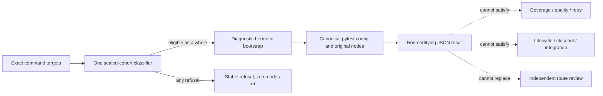

# Canonical Python Direct Diagnostics and Evidence Firewall

The repository has one direct Python diagnostic command:

```text
./scripts/test-python mcp/tests/test_file.py::test_name [EXACT_NODE ...]
```

It is deliberately a narrow feedback lane, not a second acceptance plane. The command classifies
the complete request before pytest starts, runs at most eight exact nodes in the given order with
one serial worker, and emits structured JSON whose altitude is always `diagnostic` and whose
`certifying` field is always `false`.



## Invocation contract

Each argument must be one exact node already declared in
`mcp/tests/python-direct-cohort.toml`, currently in the form
`mcp/tests/test_python_direct_cohort.py::test_function`.

Empty requests, non-members, duplicate nodes, parameterized manifest nodes, more than eight nodes,
pytest flags, and every worker or distribution flag refuse before execution. The classifier also
refuses the complete request when any sealed dependency/effect fact is unsafe or unknown, a local
import/symbol reference is unresolved, or an audited file/configuration fingerprint changed. A
refusal never runs an eligible subset and never falls back to Dagger.

The manifest is not a name/path allowlist: it records exact content hashes, audited symbols,
candidate-local imports, complete effect disposition, and per-node symbol closure. There is no
auto-refresh option. A source or configuration edit invalidates admission until that exact audit is
deliberately reviewed and updated.

The wrapper pins Python 3.12 to match the Ubuntu Noble certifying environment. Pytest reads the
repository's canonical `pyproject.toml`, loads the shared capability-minimal bootstrap, disables
conftest discovery, and forces `-n=0` after canonical options. Tests, node IDs, and assertions are
not copied or branched for diagnostics. The candidate binding is checked before and after the
process so a result is discarded if code or configuration changes while it runs.

## Structured result contract

Successful and ordinary failing tests produce `python-direct-diagnostic/v1` with:

- `status: passed | failed`
- `altitude: diagnostic`
- `certifying: false`
- the exact ordered node outcomes
- a content binding over the sealed manifest, selected nodes, audited closure, and configuration
- the pytest exit code and elapsed diagnostic duration
- reproducible route and pytest phase timestamps for admission, bootstrap, collection,
  first-node start, execution, and reporting
- bounded pytest stdout/stderr captured inside the same non-certifying JSON object

A classified refusal has `status: refused`, `executed: false`, `executedNodeCount: 0`, a stable
refusal code, source-backed target/dependency context when available, and the explicit next action.
An infrastructure contradiction such as a missing child report, changed candidate, or signal
termination has `status: error` and also grants no evidence.

The shared `pytest_phase_reporter` emits the same timestamp, node-ID, and outcome vocabulary in
the direct process and the Dagger quality process. Dagger exports `pytest-phases.json` inside the
same immutable report generation as its authoritative result; the direct command embeds the
phase record in its local JSON. This makes route measurements comparable without making the
diagnostic record certifying. The hermetic child also routes `TMPDIR`, `TMP`, and `TEMP` through
native POSIX scratch storage, so inherited Windows temp paths cannot redirect or break pytest in
WSL.

## Evidence firewall

The diagnostic process never receives the Dagger nonce, Dagger admission capability, certifying
service plugin, coverage publisher, retry publisher, quality publisher, or lifecycle writer.
Removing the nonce from the child environment is defense in depth; the capability is absent from
the diagnostic composition itself.

The accepting side is independently closed:

| Consumer | Enforcement |
| --- | --- |
| Coverage | Quality planning requires opaque Dagger admission before pytest/coverage steps exist. |
| Quality | Only the Dagger executor may publish an immutable quality generation and mint in-memory evidence after a passed result. |
| Retry | Proof preparation requires opaque Dagger admission. |
| Route review | The plane accepts only its own candidate-stamped independent review record; there is no test-evidence input. |
| Lifecycle | Strict quality success requires the certifying capability and an unchanged candidate tree. |
| Closeout | The published generation must be passed, hash-valid, and bound to the staged candidate tree. |
| Integration | The same publication proof must match the exact integration candidate or organizational attestation. |

The publication manifest is `2.0` and requires `candidateTree`; there is no compatibility reader
for unbound manifests. Copying or renaming diagnostic output cannot create the required Dagger
result schema, immutable publication, passed-result proof, candidate binding, or private
capability. A failed Dagger result remains a durable quality failure report, but it cannot mint
acceptance authority.

## Non-goals

This route does not make unsafe tests host-runnable, mass-label the suite, change coverage policy,
redesign fixtures, replace Dagger, or weaken the existing direct-Vitest boundary. Expansion beyond
the first measured cohort requires a separate decision after the master acceptance report.
