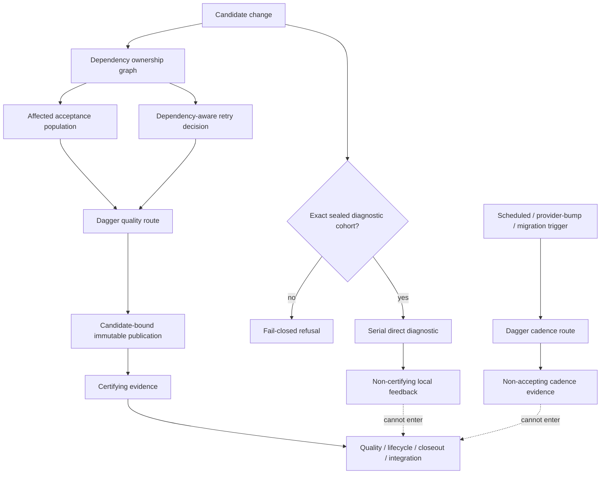

# Python Test Evidence System

Agents Remember separates test evidence by what it can prove, who owns its truth, how much
execution fidelity it needs, when it should run, and how long it should remain. Dagger is the sole
Python acceptance authority. Faster and less frequent routes exist, but neither speed nor use of a
Dagger container automatically gives a result acceptance authority.



## Evidence altitude

There are two evidence altitudes:

| Altitude | Construction | Consumers |
| --- | --- | --- |
| Diagnostic | Exact nodes admitted by the sealed direct-cohort policy and executed serially by `./scripts/test-python`. | Local developer or agent feedback only. |
| Certifying | A passed quality result published by the Dagger executor in an immutable generation bound to the exact candidate tree and result digest. | Coverage, quality, retry, lifecycle, closeout, and integration. |

`DiagnosticTestEvidence` and `CertifyingTestEvidence` are different types. Certifying evidence has
no public constructor. The nonce/file admission handshake prevents ordinary wrong-route startup,
but it is not treated as authentication against the owner of the repository and interpreter. The
immutable Dagger publication is the durable acceptance boundary.

Direct diagnostics do not silently invoke Dagger, and a failed or non-accepting Dagger cadence run
does not become acceptance evidence. There is no compatibility reader for the superseded
publication schema and no bypass flag that changes evidence altitude.

## Executable evidence categories

`agents_remember.testing.evidence_lanes` is the closed executable category registry.

| Category | Default authority | Minimum fidelity | Normal trigger | Expected lifetime |
| --- | --- | --- | --- | --- |
| Unit regression | Owned product behavior | In-process | Affected, release | While the behavior is supported |
| Public contract | Supported port or wire contract | Public boundary | Affected, release | While the contract is supported |
| Integration | Real composition or local process boundary | Local composition | Affected, release | While the composition is supported |
| Architecture fitness | Repository architecture contract | Repository structure | Affected, release | While the architecture rule is active |
| Provider conformance | Independent recording or specification | Independent boundary | Affected, provider bump, release | Versioned to the provider/protocol |
| Stress/durability | Process, race, load, or historical-sensitivity contract | Process/race | Scheduled, release | While the durability contract is supported |
| Migration | Named temporary transition owner | Transition comparison | Affected, migration window, release | Until verified graduation or expiry |
| Diagnostic | Exact-node direct route | Exact-node diagnostic | Explicit diagnostic invocation | Invocation-local only |

Unmarked tests are ordinary unit regressions. Category markers are mutually exclusive. Provider
gates are classified as provider conformance even when the test author omitted the category marker.
The affected route excludes sustained stress; the full release route runs the whole population.
Scheduled, provider-bump, and migration-window commands run in the pinned Dagger environment but
write explicitly non-accepting results. Release and direct-diagnostic triggers are not accepted by
that cadence runner, so it cannot become a shadow quality route.

## Durable evidence lifecycle

`mcp/tests/evidence-lifecycle.toml` is the machine-readable inventory for durable fixtures,
recordings, recording generators, migration proofs, and shared support. Every entry declares:

- path, kind, authority, owner, category, and minimum fidelity;
- cadence, source version or generator, and the task/reason that introduced it;
- lifetime plus either a permanence rationale or an expiry date;
- an executable replacement contract; and
- every current consumer.

The catalog is validated in local static hooks and in both Dagger quality modes. It fails on an
uncataloged governed artifact, missing consumer, unknown field, contradictory authority/lifetime,
expired migration, nonexistent replacement node/contract, or missing rationale. `node:` replacement
references are parsed and must name exactly one real top-level function or class method; prose that
merely resembles a selector is not sufficient.

The current inventory contains 27 artifacts: 14 independent recordings, one recording generator,
one non-Python fixture, and 11 shared-support files. Ten are permanent, 16 are versioned, and one
is demo-only. There is no surviving task/date-shaped migration proof in the governed population.

## Fixture authority

One authority rule governs fixture design:

```text
internally owned shape -> canonical product model/builder + scenario-local override
external boundary truth -> independent recording/specification/version or deliberate malformed case
```

The rule does not require provider recordings to be regenerated from production adapters; that
would make conformance self-referential. Conversely, internally owned schemas should not be copied
into permanent hand-authored baseline universes.

The previous model-split JSON baseline and its test were retired assertion by assertion. Stable
architecture rules moved to `test_conversation_model_architecture.py`; public serialization and
wire suites continue to own supported behavior. Exact dataclass/Pydantic migration shapes,
self-validation of the comparison helper, and well-formedness-only sample checks expired.

`build_rich_sim.py` and its only self-validating test were removed: no product or acceptance
consumer used the generated world. `_control_plane.py` remains the real conversation-control
composition port, while caller-chosen provider event scripts moved to `_adapter_event_scripts.py`.
The extracted scripts produce independent provider frames; they do not choose product settlement
policy or duplicate a provider runtime.

## Quality obligations by surface

Static correctness and behavioral certification are deliberately not identical populations.

| Rail | Product Python | Ordinary tests | Shared test support | Durable fixtures |
| --- | :---: | :---: | :---: | :---: |
| Ruff / format | yes | yes | yes | n/a |
| Pyright | yes | yes | yes | n/a |
| File size | yes | yes | yes | n/a |
| Layering | package graph | import participation | import participation | n/a |
| Evidence lifecycle | when governed | when governed | yes | yes |
| Radon report | changed/measured product only | no | no | no |
| CRAP | measured product functions only | no | no | no |
| Changed statement/branch coverage | changed product units only | no | no | no |
| Pytest | affected or release population | executes | executes through consumers | executes through consumers |

Test and support code therefore remain linted, formatted, typed, size-bounded, and directly tested
where they own risky logic. Adding a branch to test support no longer creates a production CRAP or
changed-coverage obligation that recursively demands another test solely to certify the testing
machinery. Production thresholds and changed-unit coverage remain unchanged.

## Dependency-owned selection

`DependencyOwnershipGraph` is the single owner used by targeted selection, retry proof, and causal
preflight. It records why each test was selected:

- transitive import consumer;
- lifecycle-catalog declared consumer;
- exact changed test;
- narrow name or text heuristic;
- global pytest input; or
- explicit safe-full refusal when ownership is incomplete.

The graph treats root pytest configuration and `conftest.py` as global. A changed support module
uses declared and import consumers. A governed recording/fixture uses catalog consumers. An
ordinary test selects itself. Unowned executable/support input, parse errors, ambiguous module
identity, invalid lifecycle metadata, and deleted test modules fail closed to the safe population.
Documentation-only changes remain visible but do not invent a Python test owner.

Broad fan-out is not automatically a false positive. A central conversation model currently has
440 import consumers; those are real transitive ownership edges. The report separates those edges
from 65 supplementary text-reference reasons instead of calling the complete population
heuristic. A contained product module resolves 28 tests, `_adapter_event_scripts.py` resolves its
two declared/import consumers, and the recorded Codex fixture resolves exactly three declared
consumers.

## Dependency-aware retry proof

Retry is an internal Dagger optimization after a passed pytest run and a later coverage-derived
failure. Its schema binds repository bytes, selected tests, diff base, Python/tool versions,
environment digest, and measurement settings.

| Candidate change after a proof | Retry decision |
| --- | --- |
| No change | Reuse exact proof; pytest does not restart. |
| Completely owned, no affected selected test | Reuse exact proof. |
| Completely owned ordinary test/support/fixture change | Remove affected test contexts and collection context, then rerun affected selected tests with coverage append. |
| Affected consumer lies outside the current selection | Fresh safe population. |
| Global input, incomplete/ambiguous ownership, selection/config/environment drift, corrupt proof, or missing contexts | Fresh safe population. |

The retry path never chains a filtered proof as a new baseline. A passing wrapper deletes the
proof; only a fresh full pytest pass followed by a later rail failure may publish one. Lifecycle
acceptance may disable reuse, and diagnostic execution cannot read or publish retry authority.

## Causal failure localization

The quality route validates high-fanout prerequisites once at their owner before pytest. A failed
preflight writes one stable causal identity and uses only declared/import ownership edges to mark
dependent test files as blocked. Incomplete ownership never produces blanket suppression.

Pytest still executes independent evidence. The resulting JSON and Markdown artifacts contain the
first causal failure, corrective owner, dependency chains, blocked nodes, and independent
failures. Process-, socket-, async-, or multiprocessing-sensitive failures keep their exact node,
seed, worker, timing, and process-family reproduction semantics. The causal artifact is always
`acceptanceEligible=false`; a preflight failure still fails the quality route even when dependent
symptoms are skipped.

## Supported commands and cadence

| Intent | Command owner | Authority |
| --- | --- | --- |
| Exact Python feedback | `./scripts/test-python <EXACT_NODE ...>` | Diagnostic only; one to eight sealed-cohort nodes, serial |
| Targeted leaf acceptance | lifecycle-owned Dagger `quality --mode=targeted` | Certifying when the exact publication passes |
| Master/release acceptance | lifecycle-owned Dagger `quality --mode=full` | Sole whole-system Python acceptance |
| Scheduled stress | Dagger `cadence-evidence --trigger=scheduled` | Non-accepting cadence evidence |
| Provider refresh | Dagger `cadence-evidence --trigger=provider-bump` | Non-accepting cadence evidence |
| Migration window | Dagger `cadence-evidence --trigger=migration-window` | Non-accepting cadence evidence or loud not-applicable result |
| Targeted Vitest | existing dashboard command | Diagnostic only; unchanged by this reform |

Host pytest and direct invocation of the quality wrapper remain unsupported. The direct Python
route accepts exact manifest nodes, not arbitrary pytest flags, files, globs, markers, or a whole
suite. Any refusal executes zero nodes and never substitutes another route.

## Maintenance rules

1. Add durable evidence only with complete lifecycle metadata and an executable replacement.
2. Prefer canonical builders for internal truth and independent recordings/specifications for
   external truth.
3. Add ownership edges to the lifecycle catalog or real imports; do not add a second selector map.
4. Treat safe-full behavior as a correctness refusal with a named cause, not a silent fallback or
   compatibility mechanism.
5. Keep stress out of affected repair runs without deleting deterministic durability regressions.
6. Do not expand the direct cohort without a separate measured decision. Update hashes only after
   re-auditing every declared import, symbol, fixture, and effect fact.
7. Preserve one unresolved requirement set during review. Reviewer findings describe deltas; they
   do not create new leaf scope or restart already-approved requirements.
8. Run one full Dagger gate only after the complete master candidate is assembled.

The implementation-specific direct-route contracts remain in
`python-direct-diagnostics.md`, `python-direct-cohort.md`, `python-pytest-bootstrap.md`, and
`python-test-evidence.md`.
