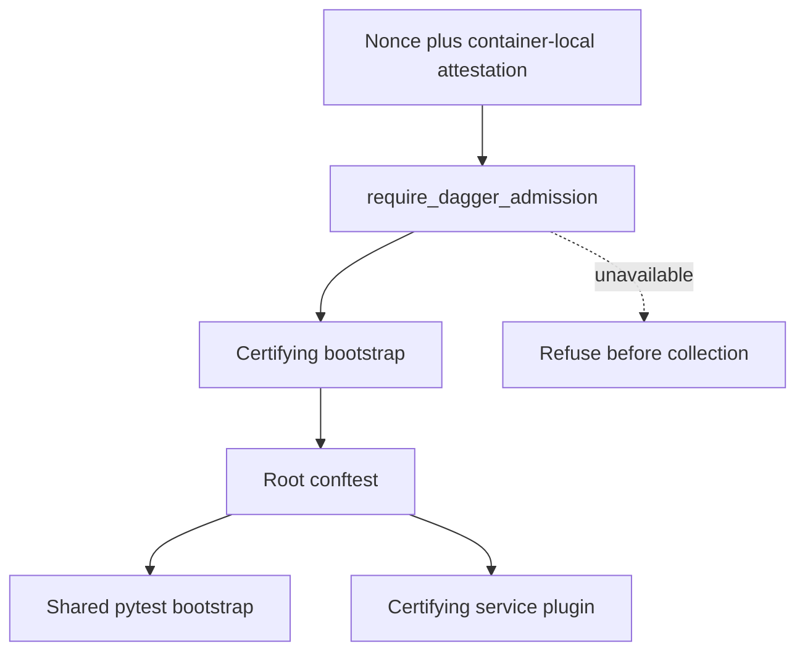

# Python Pytest Admission and Bootstrap Boundary

Python pytest execution is supported only inside the pinned Dagger graph. Admission and reusable
process setup remain separate responsibilities: the capability authorizes the certifying route;
the shared bootstrap establishes deterministic pytest behavior. Missing admission is a refusal,
never a route selector.

## Owners

| Concern | Sole owner | Result |
| --- | --- | --- |
| Dagger nonce/file handshake | `testing.dagger_admission` | opaque `DaggerAdmission` or one controlled refusal |
| Candidate source and process environment | `testing.hermetic_bootstrap` | candidate-bound import path, scrubbed Git selectors, disposable identity, isolated cache and native POSIX temp paths |
| Certifying composition | `testing.certifying_bootstrap` and root conftest | admission before plugin loading or collection |
| Shared pytest behavior | `testing.pytest_bootstrap` | test-process declaration, cache isolation, deterministic order, owned-global restoration |
| Certifying-only services | `testing.pytest_certifying_bootstrap` | worktree service binding and teardown |

`DaggerAdmission` has no public constructor and stores only a digest of the nonce. The only way to
receive it is to pass the real nonce/file handshake. That handshake is an in-process wrong-route
guard, not authentication against a hostile repository owner; durable authority comes from the
Dagger executor's immutable candidate-bound publication.

## Preserved protections

The certifying route retains candidate import pinning, Git selector scrubbing, disposable Git
identity, explicit test-process declaration, per-process/worker cache isolation, owned-global
restoration, deterministic random ordering, route-neutral phase/node reporting, and certifying
service composition. The shared module does not import admission, providers, or worktree services;
the certifying composition adds those capabilities only after admission succeeds.

## Candidate A retirement boundary

The former diagnostic composition and its `EligibleDirectSelection` were deleted when Candidate A
failed its measured retention threshold. `scripts/test-python`, its manifest, classifier,
diagnostic bootstrap, and compatibility surface do not exist. This is an evidence-backed terminal
disposition under the approved master, not a fallback to host pytest. Arbitrary non-certifying
objects remain rejected by accepting consumers.

The focused pure proof is `mcp/tests/test_pytest_bootstrap_boundaries.py`. It checks valid and
invalid certifying admission, shared-bootstrap isolation, absence of Candidate-A shadows, and
rejection of non-certifying elevation. The final master gate later exercises the same certifying
composition inside the real Dagger graph.
