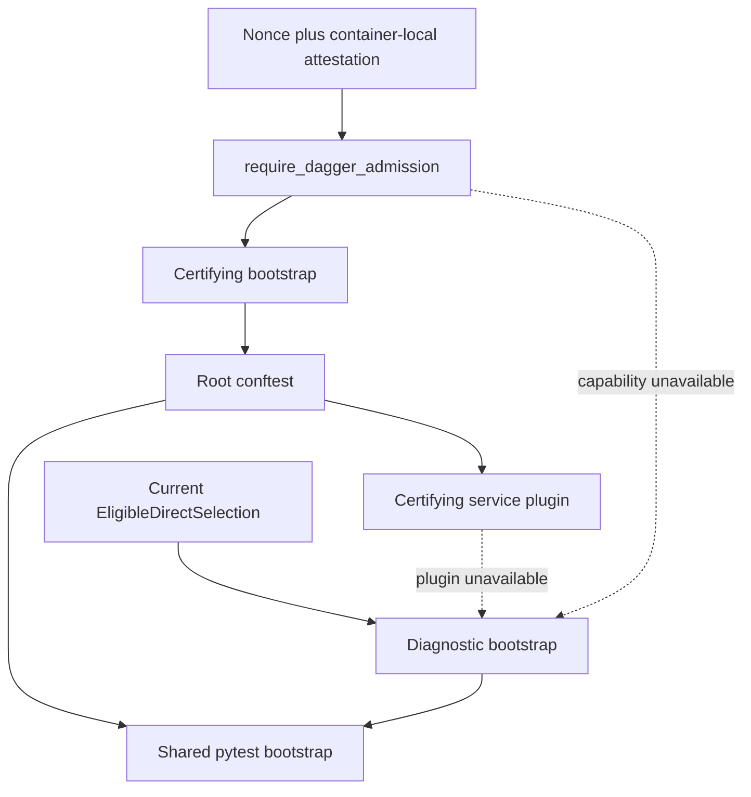

# Python Pytest Admission and Bootstrap Boundary

The certifying and diagnostic routes share deterministic process setup, but only the Dagger route
can obtain admission or load certifying-only service composition. Missing admission is a refusal;
it is never a route selector.

## Owners

| Concern | Sole owner | Result |
| --- | --- | --- |
| Dagger nonce/file handshake | `testing.dagger_admission` | opaque `DaggerAdmission` or one controlled refusal |
| Candidate source and process environment | `testing.hermetic_bootstrap` | candidate-bound import path, scrubbed Git selectors, disposable identity, isolated cache and native POSIX temp paths |
| Certifying composition | `testing.certifying_bootstrap` and root conftest | admission before plugin loading or collection |
| Diagnostic composition | `testing.diagnostic_bootstrap` | still-current eligible selection, with no admission field |
| Shared pytest behavior | `testing.pytest_bootstrap` | test-process declaration, cache isolation, deterministic order, owned-global restoration |
| Certifying-only services | `testing.pytest_certifying_bootstrap` | worktree service binding and teardown |

`DaggerAdmission` has no public constructor and stores only a digest of the nonce. The diagnostic
composition does not import it, accept it, or expose a boolean that could change evidence altitude.
The only way to receive it is to pass the real nonce/file handshake.

## Component matrix

| Protection | Certifying | Direct diagnostic | Reason |
| --- | :---: | :---: | --- |
| Candidate checkout import pin | yes | yes | both routes must test the same source |
| Git repository-selector scrub | yes | yes | ambient selectors cannot redirect any imported helper or subprocess |
| Disposable Git identity | yes | yes | no test process inherits developer identity |
| Test-process declaration | yes | yes | checkout coordination stays in explicit test mode |
| Per-process/worker cache isolation | yes | yes | independent executions cannot share application cache state |
| Owned-global leak restoration | yes | yes | pass, failure, and teardown restore registered state |
| Deterministic random-order support | yes | yes | one pytest configuration and hook implementation |
| Route-neutral phase/node report | yes | yes | one reporter vocabulary supports parity and cost analysis without sharing authority |
| Worktree/provider service composition | yes | no | Candidate A refuses any test whose closure needs these unsafe families |
| Dagger admission capability | yes | no | diagnostic output cannot certify work |

The diagnostic omission is structural rather than a speed switch: the L1 classifier refuses Git,
worktree, provider, container, service, durability, and integration closure. Therefore an admitted
diagnostic test cannot legitimately consume the certifying service bundle.

## Four-state forcing proof

| State | Expected boundary |
| --- | --- |
| Valid certification | matching nonce/file mints admission, then candidate bootstrap proceeds |
| Valid diagnostics | current eligible selection prepares bootstrap without consulting admission |
| Invalid certification | missing, malformed, unavailable, or mismatched admission refuses before candidate resolution and collection |
| Attempted elevation | diagnostic evidence is rejected by accepting consumers and a caller-shaped admission object is rejected |

The focused pure proof is `mcp/tests/test_pytest_bootstrap_boundaries.py`. It models admission facts
without starting Dagger, a socket, a service, Git, or pytest itself. The final master gate later
exercises the same production composition inside the real Dagger graph.
