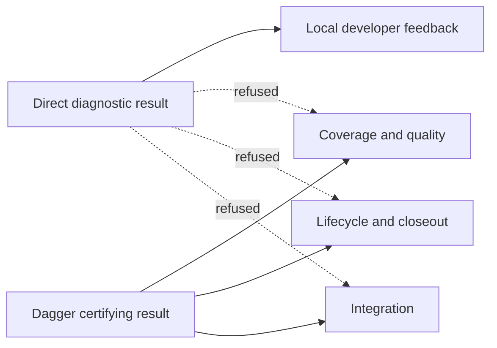

# Python Test Evidence Altitudes and Direct Eligibility

Python test execution has two deliberately different evidence altitudes:

The direct route is a bounded feedback mechanism. It never certifies a commit, satisfies
coverage or quality, publishes retry proof, supplies route-review evidence, advances a lifecycle,
unlocks closeout, or authorizes integration. The pinned Dagger graph remains the sole Python
acceptance authority.

## Eligibility contract

`agents_remember.testing.classify_direct_selection` is the one policy owner. It accepts only a
non-empty, serially bounded list of exact pytest node IDs from
`mcp/tests/python-direct-cohort.toml`. Before pytest can start it validates the whole sealed audit:
exact file and configuration fingerprints, declared local-import closure, audited symbols, known
effect disposition, exact top-level nodes, and fixture/autouse membership.

The entire request admits or refuses as one unit. It refuses non-member, missing, ambiguous,
parameterized, duplicate, oversized, mixed, dynamically unresolved, unsafe, or unsupported
closure. The eligible decision contains the exact nodes, audited closure observations, and a
digest over the manifest and every closure/configuration file. A changed candidate, manifest, or
pytest configuration invalidates that decision.

Names, paths, and markers are not admission authority. A node name identifies a manifest member;
admission additionally requires exact audited content and known-safe dependency/effect facts.
There is deliberately no generic repository analyzer or refresh switch: changed audited content
refuses until the manifest closure is reviewed and deliberately updated in the same change.

## Closed unsafe families

An effect must be positively known as allowed. Unknown behavior refuses. These families always
stay in Dagger for this intervention:

| Family | Includes | Direct result |
| --- | --- | --- |
| `git-worktree` | Git, repositories, indexes, worktrees, destructive repo operations | refuse |
| `process-control` | subprocesses, PTYs, signals, multiprocessing, process control | refuse |
| `socket-service` | sockets, ports, servers, network clients | refuse |
| `provider-container` | providers, Docker, containers, Dagger | refuse |
| `browser-external` | browsers, external UI, serving/runtime environment | refuse |
| `machine-state` | credentials, home/configuration state, persistent files | refuse |
| `mutable-global-state` | unguarded process-global mutation | refuse |
| `durability-integration` | stores, recovery, lifecycle, closeout, integration, end-to-end safety | refuse |

## Consumer inventory

The executable inventory lives in
`agents_remember.testing.consumer_inventory.ACCEPTING_CONSUMER_INVENTORY`. It covers:

| Consumer | Current owner | Required evidence |
| --- | --- | --- |
| Coverage | `code_quality.check._pytest_step` | certifying only |
| Quality | `worktrees.modules.quality.clean_executor.run_clean_quality` | certifying only |
| Retry | `code_quality.retry_proof.prepare` | certifying only |
| Route review | `worktrees.route_review.require_current_route_review` | independent candidate-bound verdict; no test substitution |
| Lifecycle | `worktrees.modules.quality.gate.run_strict_code_quality_gate` | certifying only |
| Closeout | `worktrees.queue.closeout_staged_quality.gate_staged_code` | certifying only |
| Integration | `worktrees.integration.integration_quality.run_integration_quality_gate` | certifying only |

`DiagnosticTestEvidence` and `CertifyingTestEvidence` are separate capabilities in
`models/test_evidence.py`. Certifying evidence cannot be constructed through its public
initializer. The Dagger executor mints it only after a successful pipeline result is published in
an immutable generation whose manifest binds the exact candidate tree and result digest. Recovery
revalidates that same generation, passed result, and candidate binding before it can mint the
capability again.

Coverage and retry require the opaque `DaggerAdmission` capability before they can plan or publish
their artifacts. Lifecycle, closeout, and integration require candidate-bound certifying evidence.
Route review remains an independent plane-stamped verdict and exposes no test-evidence input at
all. A caller-provided label, copied diagnostic JSON, renamed file, zero exit code, failed Dagger
result, or manifest for another candidate has no authority.

## Master boundary

Candidate A is only the bounded diagnostic route. The same master separately owns evidence
retirement, recursive-certification repair, fixture authority, lane/cadence separation,
dependency-owned selection and retry, evidence-lifecycle metadata, and causal failure
localization. None of those Candidates B-H is deferred into this route or claimed by a direct
diagnostic result.

| Changed surface | Requirement ownership |
| --- | --- |
| `models/test_evidence.py`, `testing/consumer_inventory.py` | typed altitudes and accepting consumers |
| `testing/selection_contract.py`, `testing/eligibility.py` | one total atomic classifier API |
| `testing/cohort_manifest.py`, `mcp/tests/python-direct-cohort.toml` | strict sealed-audit schema and the only admitted cohort |
| `testing/unsafe_effects.py` | closed unsafe-family vocabulary and stable refusal reasons |
| `test_direct_test_eligibility.py` | forcing proof for eligibility, refusal, drift, and evidence altitude |
