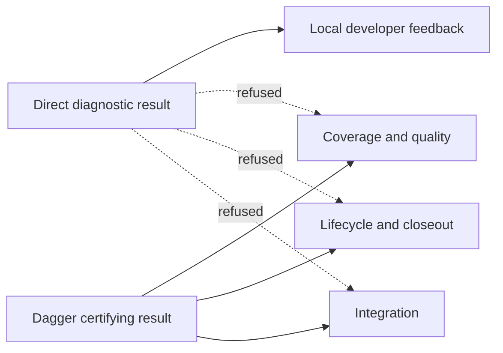

# Python Test Evidence Altitudes and Direct Eligibility

Python test execution has two deliberately different evidence altitudes:

The direct route is a bounded feedback mechanism. It never certifies a commit, satisfies
coverage or quality, publishes retry proof, supplies route-review evidence, advances a lifecycle,
unlocks closeout, or authorizes integration. The pinned Dagger graph remains the sole Python
acceptance authority.

## Eligibility contract

`agents_remember.testing.classify_direct_selection` is the one policy owner. It accepts only a
non-empty, serially bounded list of exact pytest node IDs. Before pytest can start it statically
resolves every requested node, candidate-owned import, selected helper, local fixture, module
autouse fixture, and collection-time expression that the first cohort supports.

The entire request admits or refuses as one unit. It refuses missing, ambiguous, parameterized,
duplicate, oversized, mixed, dynamically resolved, unknown, or unsupported closure. The eligible
decision contains the exact nodes, source-backed closure observations, and a digest over every
closure/configuration file. A changed candidate or pytest configuration invalidates that decision.

Names, paths, and markers are not admission authority. They identify the exact requested node; they
do not make it safe. Moving an unsafe test or adding a `pure` marker does not change its effect
classification.

## Closed unsafe families

An effect must be positively known as allowed. Unknown behavior refuses. These families always
stay in Dagger for this intervention:

| Family | Includes | Direct result |
| --- | --- | --- |
| `git-worktree` | Git, repositories, indexes, worktrees, destructive repo operations | refuse |
| `process-control` | subprocesses, PTYs, signals, multiprocessing, process control | refuse |
| `socket-service` | sockets, ports, servers, network clients | refuse |
| `provider-container` | providers, Docker, containers, Dagger | refuse |
| `browser-external` | browsers, external UI, serving/runtime environment | refuse |
| `machine-state` | credentials, home/configuration state, persistent files | refuse |
| `mutable-global-state` | unguarded process-global mutation | refuse |
| `durability-integration` | stores, recovery, lifecycle, closeout, integration, end-to-end safety | refuse |

## Consumer inventory

The executable inventory lives in
`agents_remember.testing.consumer_inventory.ACCEPTING_CONSUMER_INVENTORY`. It covers:

| Consumer | Current owner | Required evidence |
| --- | --- | --- |
| Coverage | `code_quality.check._pytest_step` | certifying only |
| Quality | `worktrees.modules.clean_quality_executor.run_clean_quality` | certifying only |
| Retry | `code_quality.retry_proof.prepare` | certifying only |
| Route review | `worktrees.route_review.require_current_route_review` | independent candidate-bound verdict; no test substitution |
| Lifecycle | `worktrees.modules.code_quality_gate.run_strict_code_quality_gate` | certifying only |
| Closeout | `worktrees.queue.closeout_staged_quality.gate_staged_code` | certifying only |
| Integration | `worktrees.integration.integration_quality.run_integration_quality_gate` | certifying only |

`DiagnosticTestEvidence` and `CertifyingTestEvidence` are separate capabilities in
`models/test_evidence.py`. Certifying evidence cannot be constructed through its public
initializer. The Dagger executor mints it only after a successful pipeline result is published in
an immutable generation whose manifest binds the exact candidate tree and result digest. Recovery
revalidates that same generation, passed result, and candidate binding before it can mint the
capability again.

Coverage and retry require the opaque `DaggerAdmission` capability before they can plan or publish
their artifacts. Lifecycle, closeout, and integration require candidate-bound certifying evidence.
Route review remains an independent plane-stamped verdict and exposes no test-evidence input at
all. A caller-provided label, copied diagnostic JSON, renamed file, zero exit code, failed Dagger
result, or manifest for another candidate has no authority.

## Intervention boundary

Candidate A—safe direct Python diagnostics—is the sole implemented mechanism. The following remain
deferred and are not hidden inside this change: model-baseline retirement, support-code quality or
coverage policy, fake-process replacement, stress cadence, retry redesign, richer lifecycle
evidence schemas, failure-localization work, mass sibling-import migration, fixture-builder
redesign, and broad test deletion or reclassification.

| Changed surface | Requirement ownership |
| --- | --- |
| `models/test_evidence.py`, `testing/consumer_inventory.py` | typed altitudes and accepting consumers |
| `testing/selection_contract.py`, `testing/eligibility.py` | one total atomic classifier API |
| `testing/python_source.py`, `testing/collection_closure.py`, `testing/dependency_closure.py` | structural collection/import/helper/fixture closure |
| `testing/unsafe_effects.py` | closed unsafe-family taxonomy and positive effect model |
| `test_direct_test_eligibility.py` | forcing proof for eligibility, refusal, drift, and evidence altitude |
