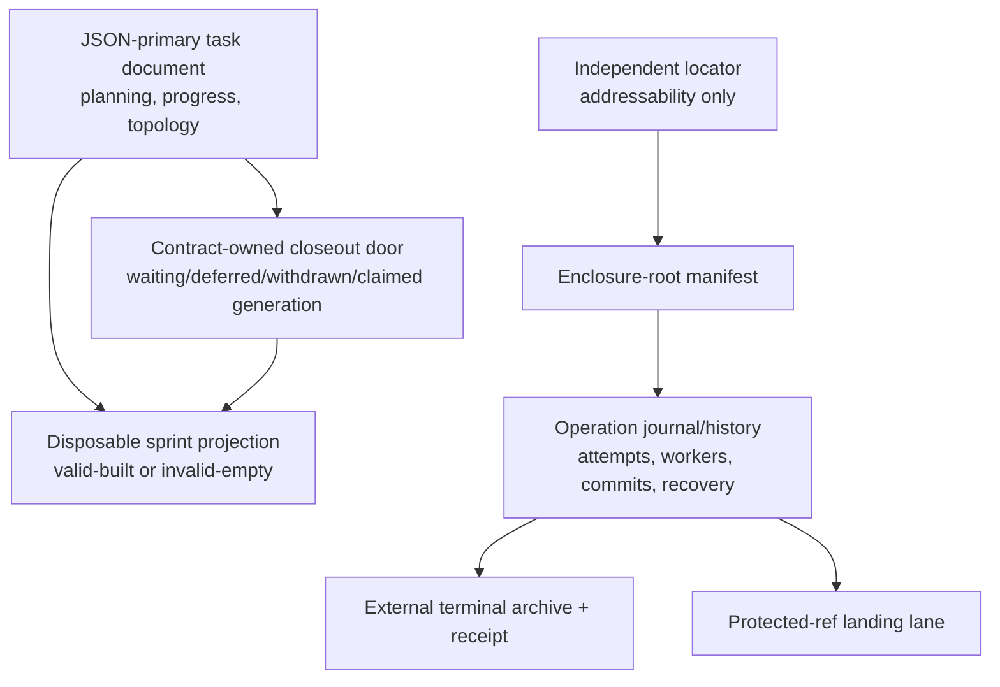

# `c-09-git-worktree-manager` Worktrees And Closeout

The `c-09-git-worktree-manager` skill owns worktree creation, exact enclosure addressability,
integration, terminal archival, and cleanup. The `c-12-closeout` skill owns validated immutable
closeout input, approval, acceptance, and code-memory-ledger commit order.

## When To Use It

Use the `c-09-git-worktree-manager` skill when:

- a task needs isolated code and memory worktrees;
- external-memory closeout needs code and memory commits mapped in `memory.md`;
- a live or interrupted closeout/integration must be observed or recovered by task address;
- the developer wants explicit preview, approval, integration, and cleanup boundaries.

## One Owner Per Plane



Task documents remain writable during every closeout phase. A short claim CAS accepts one exact
task/door revision, then ends before worker execution, quality, or Git mutation. It is not a
durable task lock.

The closeout queue contains only current schedulable `waiting` door generations. It never owns
selection history, in-flight/certified rows, attempts, commits, recovery, integration, or audit.
Accepted work remains addressable in the operation journal even when the projection is absent or
invalid-empty.

## Stable Address And Enclosure Root

The configured leaf `series-contract.md` is the stable public address. `worktree_start` publishes:

1. one independent address-only locator for that contract;
2. one immutable `.lifecycle/enclosure-manifest.json` under the worktree enclosure root;
3. the exact initial contract generation;
4. root-local operation journals/history as operations are accepted.

Lifecycle reads use exactly two strict routes:

```text
live:     contract address -> addressable locator -> root manifest -> root journal/history
terminal: contract address -> terminal locator -> exact external archive + receipt
                                            + surviving contract truth
```

Attach, operation control, and live recovery use only the live route. A terminal locator is never
reinterpreted as permission to follow the old root path: the archive preserves its collected
manifest/journal/history and the configured contract supplies current cleanup truth. Neither route
scans task documents or worktree folders, infers a name, trusts a caller-supplied root, or uses
`reports/` as lifecycle authority.

`worktree_status` is the public status action for either route. In the live state it reports the
current journal generation and executable controls. In the terminal state it distinguishes
archive-ready from cleanup-completed and reports the surviving contract state; it does not claim
that the old live root remains addressable. If the locator is archive-ready but contract cleanup is
not yet `completed` or `abandoned`, retry the archive's exact accepted public disposition with its
archived arguments: `worktree_cleanup` with the accepted `teardown_providers` value or
`worktree_abandon` with the accepted `force` value. The archive request identity durably binds this
typed `cleanupArguments` object. Status and terminal-request conflicts return it with the exact
public `nextArgs`; a retry with different arguments refuses rather than revising, defaulting, or
falling back. Do not route that terminal retry through `worktree_operation_control`.

For a proven old enclosure created before locators existed, `worktree_enclosure_adopt` is the one
explicit audited migration. Normal readers remain strict; there is no permanent compatibility
reader.

## Task Mutation And Projection Rebuild

Every intrinsically valid `task_doc` mutation publishes first. The same transaction identifies the
before/after governing-sprint union, persists every affected projection as non-admitting
`invalid-empty`, and rebuilds each independently from current task truth plus current waiting-door
facts. The response's `projectionEffects` names each scope and carries an exact `nextAction` when a
rebuild did not finish.

Execute that rebuild action. Do not reject or roll back the task write, retain a stale candidate,
or invent queue replan/drain controls. Unrelated sprints, standalone tasks, and repositories keep
their own projection revisions.

## Closeout And Recovery

The manager publishes a complete closeout-door generation; the orchestrator admits only the exact
first-ready generation from a current `valid-built` projection. `worktree_closeout_apply` validates
every enabled explicit nonblank commit-message cell before authority, then claims the exact
generation and starts or observes its durable journaled operation.

Use `worktree_status` for the current task-addressed generation and execute only its advertised
`worktree_operation_control` action. Pre-output failure may retry the same input, cancel, or revise
through a successor. Ambiguous or proven output must reconcile/recover the same generation. Queue
rows, raw Git, repeat-from-scratch, reports, and journal edits are not recovery paths.

The explicit `worktree_legacy_operation` tool can inspect and migrate only the proven schema-1
blank-message incident, or archive exact terminal evidence. It binds the inspected digest and
never runs from a normal reader.

## Integration And Landing Serialization

`worktree_integrate` lands the closed task into its configured source branch. It preserves
same-target protected-ref serialization, current code+memory base-pair admission,
`worktree_sync`, irreversible-edge revalidation, and atomic-blocker exclusion. Those rules may
refuse only the conflicting landing edge; they never veto task authoring.

A crash before or after ref movement is reconciled from the accepted journal plus live Git before
another operation moves the same target. The queue is not involved.

## Terminal Cleanup

The enclosure root contains canonical live evidence, so final cleanup cannot delete it merely
because task status says completed. The terminal operation must:

1. prove the exact operation generation terminal;
2. archive canonical manifest, journal, and history outside the deletion target;
3. read back and verify the exact archive bytes;
4. publish the external terminal receipt and terminal locator state;
5. only then delete worktrees, merged branches, disposable reports, and the enclosure root.

Publishing and reading back archive/receipt bytes does not switch routes by itself. Until the
locator advances, the live locator remains authoritative and an identical accepted
`worktree_cleanup` or `worktree_abandon` retry reuses those exact bytes to finish terminal-locator
publication. Only a `terminal-archived` locator makes the generation archive-ready; that state does
not prove that worktrees, branches, reports, and the root were all removed or that terminal
contract truth was published. After that locator transition, the same disposition retries until
`worktree_status` reports cleanup-completed or abandoned, always using its archived
`cleanupArguments` and exact `nextArgs`. Active or ambiguous evidence is never collectable. After
cleanup, root absence is accepted only when the exact external archive/receipt and surviving
contract truth prove deliberate deletion. A same-address reopen or sanctioned abandoned successor
requires that terminal proof and the exact restartable predecessor contract under one short CAS;
the successor manifest preserves the immediate-predecessor archive link. Once reserved, successor
publication atomically replaces only the exact accepted predecessor tombstone bytes at the stable
contract address. Already accepted successor bytes converge idempotently; any other observed bytes
refuse. This is not a generic overwrite or compatibility reader.

## Approval Boundary

Implementation approval is not commit approval. Preview the applicable worktree operation first.
Subordinate edges may proceed under recorded accepted-series authority; standalone/final work and
human-pinned gates require the developer's explicit decision. No approval mechanism becomes a task
freeze or operation-recovery fallback.
