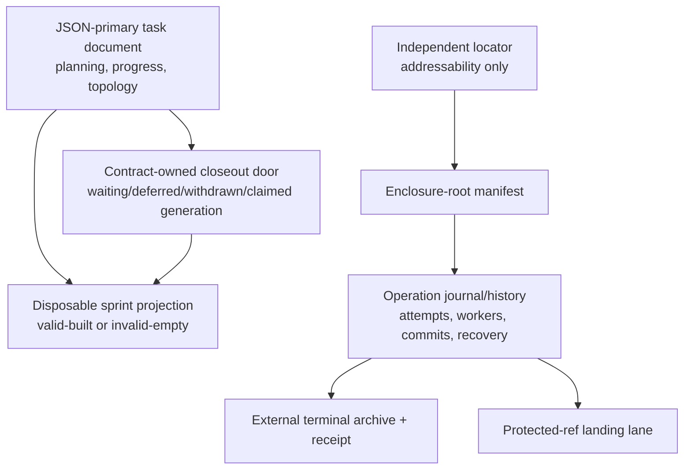

# `c-09-git-worktree-manager` Worktrees And Closeout

The `c-09-git-worktree-manager` skill owns worktree creation, exact enclosure addressability,
integration, terminal archival, and cleanup. The `c-12-closeout` skill owns validated immutable
closeout input, approval, acceptance, and code-then-memory commit order. The accepted Git pair,
its ancestry, and recorded refs supply transaction authority. `memory.md` is an ignored cache
computed from memory commit trailers; its bytes and rows never authorize or block the transaction.

## When To Use It

Use the `c-09-git-worktree-manager` skill when:

- a task needs isolated code and memory worktrees;
- external-memory closeout needs code and memory commits mapped in `memory.md`;
- a live or interrupted closeout/integration must be observed or recovered by task address;
- the developer wants explicit preview, approval, integration, and cleanup boundaries.

## One Owner Per Plane


```mermaid
flowchart TD
    T[JSON-primary task document<br/>planning, progress, topology]
    D[Contract-owned closeout door<br/>waiting/deferred/withdrawn/claimed generation]
    Q[Disposable sprint projection<br/>valid-built or invalid-empty]
    L[Independent locator<br/>addressability only]
    M[Enclosure-root manifest]
    J[Operation journal/history<br/>attempts, workers, commits, recovery]
    A[External terminal archive + receipt]
    R[Protected-ref landing lane]
    T --> D
    T --> Q
    D --> Q
    L --> M --> J
    J --> A
    J --> R
```

Task documents remain writable during every closeout phase. A short claim CAS accepts one exact
task/door revision, then ends before worker execution, quality, or Git mutation. It is not a
durable task lock.

The closeout queue contains only current schedulable `waiting` door generations. It never owns
selection history, in-flight/certified rows, attempts, commits, recovery, integration, or audit.
Accepted work remains addressable in the operation journal even when the projection is absent or
invalid-empty.

## Stable Address And Enclosure Root

The configured leaf `series-contract.md` is the stable public address. `worktree_start` publishes:

1. one independent address-only locator for that contract;
2. one immutable `.lifecycle/enclosure-manifest.json` under the worktree enclosure root;
3. the exact initial contract generation;
4. root-local operation journals/history as operations are accepted.

Lifecycle reads use exactly two strict routes:

```text
live:     contract address -> addressable locator -> root manifest -> root journal/history
terminal: contract address -> terminal locator -> exact external archive + receipt
                                            + surviving contract truth
```

Attach, operation control, and live recovery use only the live route. A terminal locator is never
reinterpreted as permission to follow the old root path: the archive preserves its collected
manifest/journal/history and the configured contract supplies current cleanup truth. Neither route
scans task documents or worktree folders, infers a name, trusts a caller-supplied root, or uses
`reports/` as lifecycle authority.

`worktree_status` is the public status action for either route. In the live state it reports the
current journal generation and executable controls. In the terminal state it distinguishes
archive-ready from cleanup-completed and reports the surviving contract state; it does not claim
that the old live root remains addressable. If the locator is archive-ready but contract cleanup is
not yet `completed` or `abandoned`, retry the archive's exact accepted public disposition with its
archived arguments: `worktree_cleanup` with the accepted `teardown_providers` value or
`worktree_abandon` with the accepted `force` value. The archive request identity durably binds this
typed `cleanupArguments` object. Status and terminal-request conflicts return it with the exact
public `nextArgs`; a retry with different arguments refuses rather than revising, defaulting, or
falling back. Do not route that terminal retry through `worktree_operation_control`.

For a proven old enclosure created before locators existed, `worktree_enclosure_adopt` is the one
explicit audited migration. Normal readers remain strict; there is no permanent compatibility
reader.

## Task Mutation And Projection Rebuild

Every intrinsically valid `task_doc` mutation publishes first. The same transaction identifies the
before/after governing-sprint union, persists every affected projection as non-admitting
`invalid-empty`, and rebuilds each independently from current task truth plus current waiting-door
facts. The response's `projectionEffects` names each scope and carries an exact `nextAction` when a
rebuild did not finish.

Execute that rebuild action. Do not reject or roll back the task write, retain a stale candidate,
or invent queue replan/drain controls. Unrelated sprints, standalone tasks, and repositories keep
their own projection revisions.

## Closeout And Recovery

The manager publishes a complete closeout-door generation; the orchestrator admits only the exact
first-ready generation from a current `valid-built` projection. `worktree_closeout_apply` validates
every enabled explicit nonblank commit-message cell before authority, then claims the exact
generation and starts or observes its durable journaled operation.

Use `worktree_status` for the current task-addressed generation and execute only its advertised
`worktree_operation_control` action. Pre-output failure may retry the same input, cancel, or revise
through a successor. Ambiguous or proven output must reconcile/recover the same generation. Queue
rows, raw Git, repeat-from-scratch, reports, and journal edits are not recovery paths.

The explicit `worktree_legacy_operation` tool can inspect and migrate only the proven schema-1
blank-message incident, or archive exact terminal evidence. It binds the inspected digest and
never runs from a normal reader.

## Raw Git Identity Boundary

`worktree_sync` is the only route that moves a task's declared identities *under measurement*: it
merges the official line into the work branch, re-captures the candidate, and records a rebinding that
names what moved. Everything else that can move them is ordinary Git, and ordinary Git leaves no
record behind. The review surface therefore measures the boundary itself — the recorded work-branch
head, the code-base commit the capture was taken from, and the memory work branch's recorded base,
each asked of the repository they name — and states which of them the repository no longer shows.
A retained uncommitted candidate supplies a tree pin without an observed work-branch head; that
ancestry channel reports `not-measured` rather than filling the missing head from today's checkout. It
performs no reconciliation: a replaced identity marks the review stale, disables submission against
it, names the identity that was replaced, and leaves the reviewed comparison generation exactly where
it is so it stays inspectable. A boundary that could not take its comparison at all — a checkout that
left its declared branch, a recorded object that is gone, a generation that could not be read —
renders `not-measured` with the reason rather than a current review, and it does not disable
submission, because no movement was observed. The same statement is attached to the closeout and
integration results, where it is a statement and never a gate: it refuses nothing, and the closeout
door's own source-lineage checks remain the only checks on that transaction.

There are no global Git hooks, no replacement Git layer, and no speculative compatibility layer. The
table below is the support matrix the code publishes and reports against; the shapes are the ones a
repository's own history can show, `unchanged` is the measured absence of any of them, and the four
this system does not reconcile say so rather than being implied by omission.

| Transition | Measured signature | Boundary state | Reconciliation | Recovery |
| --- | --- | --- | --- | --- |
| `unchanged` | every declared identity is still exactly the identity the comparison recorded: the candidate commit, the code-base commit and the memory work branch's base are all at their recorded values, so nothing was observed to move | `current` | **supported** | none required for the declared identities; this boundary compared all of them and found each still exactly where the reviewed tree comparison recorded it, so no shape was observed to reconcile |
| `ordinary-append` | the recorded candidate commit is still an ancestor of the branch tip and the tip has moved past it: the branch advanced without replacing anything the comparison recorded | `current` | **supported** | none required for the recorded identities; the branch moved forward from the recorded candidate commit without replacing it, which is the ordinary shape of work continuing under an already-recorded tree comparison |
| `rebase` | the recorded candidate commit is a readable commit object that is not an ancestor of the branch tip, so the branch was rewritten | `stale` | **unsupported** | open a new live review from the rebased tip to record the exact successor tree comparison; the previous comparison remains inspectable, and this system does not replay or reverse a rebase |
| `cherry-pick` | the branch tip differs from the recorded candidate commit while the recorded candidate commit is still an ancestor, or the code and memory trees differ while both commits still resolve | `current` | **unsupported** | record a successor tree comparison from the advanced tip -- the pick is never identified from an ancestry check alone, and no record that already exists measures it: the managed-sync rebinding exists only once a sync has carried the official line and resolved a pair, the reopen channel reports the recorded comparison's availability rather than the pick, and this boundary's own state stays 'current'. A sync that carries nothing resolves no pair and records no rebinding, so it is not a measurement of the pick either |
| `revert` | the branch advances by exactly the commits that undo earlier ones: the recorded candidate commit stays an ancestor and no ancestry check can tell the undo from any other new commit | `current` | **unsupported** | record a successor tree comparison from the branch as it now stands; a revert is never inferred from an ancestry check, and the code tree and memory candidate tree this boundary does not compare are the existing owners' measurements to take |
| `branch-switch` | the code worktree is not on the branch the contract declared -- a detached HEAD or another branch -- so the work-branch comparison cannot be taken at all | `not-measured` | **unsupported** | return the worktree to its declared work branch, then read the boundary again; this system never checks a branch out on a reader's behalf and never mutates a checkout |

The recovery is a new live review that records the exact successor code and memory tree comparison.
The previous tree comparison remains retained evidence. A boundary that could not compare a channel reports
that absence with its reason instead of a verdict, and no state that was not measured is rendered as
one that was.

## Integration And Landing Serialization

`worktree_integrate` lands the closed task into its configured source branch. It preserves
same-target protected-ref serialization, current code+memory base-pair admission,
`worktree_sync`, irreversible-edge revalidation, and atomic-blocker exclusion. Those rules may
refuse only the conflicting landing edge; they never veto task authoring.

A crash before or after ref movement is reconciled from the accepted journal plus live Git before
another operation moves the same target. The queue is not involved.

## Terminal Cleanup

The enclosure root contains canonical live evidence, so final cleanup cannot delete it merely
because task status says completed. The terminal operation must:

1. prove the exact operation generation terminal;
2. archive canonical manifest, journal, and history outside the deletion target;
3. read back and verify the exact archive bytes;
4. publish the external terminal receipt and terminal locator state;
5. only then delete worktrees, merged branches, disposable reports, and the enclosure root.

Publishing and reading back archive/receipt bytes does not switch routes by itself. Until the
locator advances, the live locator remains authoritative and an identical accepted
`worktree_cleanup` or `worktree_abandon` retry reuses those exact bytes to finish terminal-locator
publication. Only a `terminal-archived` locator makes the generation archive-ready; that state does
not prove that worktrees, branches, reports, and the root were all removed or that terminal
contract truth was published. After that locator transition, the same disposition retries until
`worktree_status` reports cleanup-completed or abandoned, always using its archived
`cleanupArguments` and exact `nextArgs`. Active or ambiguous evidence is never collectable. After
cleanup, root absence is accepted only when the exact external archive/receipt and surviving
contract truth prove deliberate deletion. A same-address reopen or sanctioned abandoned successor
requires that terminal proof and the exact restartable predecessor contract under one short CAS;
the successor manifest preserves the immediate-predecessor archive link. Once reserved, successor
publication atomically replaces only the exact accepted predecessor tombstone bytes at the stable
contract address. Already accepted successor bytes converge idempotently; any other observed bytes
refuse. This is not a generic overwrite or compatibility reader.

## Approval Boundary

Implementation approval is not commit approval. Preview the applicable worktree operation first.
Subordinate edges may proceed under recorded accepted-series authority; standalone/final work and
human-pinned gates require the developer's explicit decision. No approval mechanism becomes a task
freeze or operation-recovery fallback.
